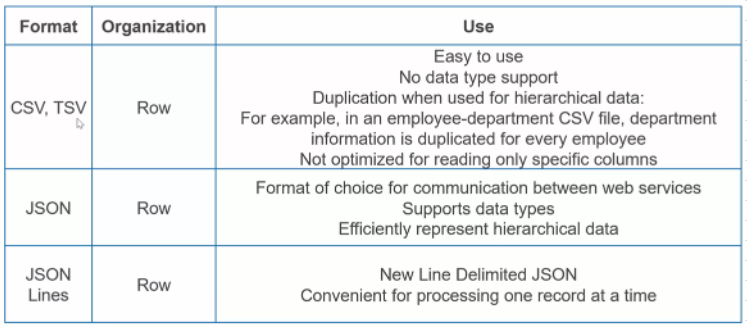
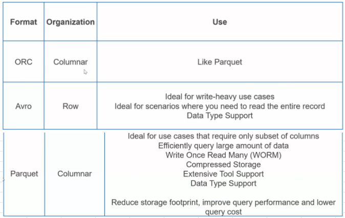
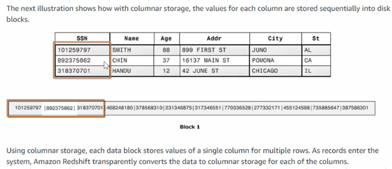
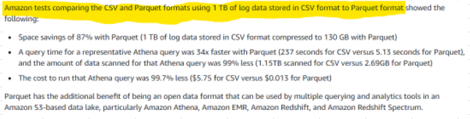

# Data formats

## [Text](https://docs.aws.amazon.com/whitepapers/latest/building-data-lakes/monitoring-optimizing-data-lake-environment.html)

## Binary
- Parquet and ORC are Columnar storage formats
### RecordIO
- RecordIO is the name for a set of binary data exchange formats. 
- The basic idea is to 
  - Divide the data into individual chunks, called 'records', and then to 
  - Prepend to every record its length in bytes, followed by the data.

## [Columnar storage](https://docs.aws.amazon.com/redshift/latest/dg/c_columnar_storage_disk_mem_mgmnt.html)

### Performance Boost with Columnar Storage

## Image data format
- JPEG
- PNG										
- **x-image**
