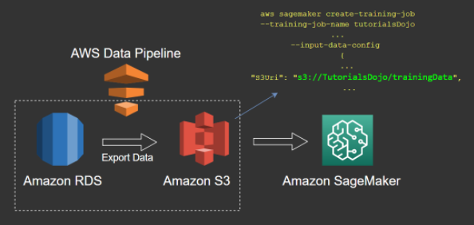

# Data transformations
## 1.  Datalake and S3
- With a data lake built on Amazon S3, you can use native AWS services to run 
  - Big data analytics, 
  - Machine learning (ML), 
  - Artificial intelligence (AI), 
  - High-performance computing (HPC), and 
  - Media data processing applications to gain insights from your unstructured data sets.


- Amazon S3 is designed for 99.999999999% (11 9s) of data durability. 
- With that level of durability, you can expect that if you store 10,000,000 objects in Amazon S3, you should only expect to lose a single object every 10,000 years! 
- The service automatically creates and stores copies of all uploaded S3 objects across multiple systems. 
- This means your data is available when needed and protected against failures, errors, and threats.
### Data Transformations	
- Collect data in Native format in datalake (S3)
- Transform data in data lake for analytics and downstream use cases
## 2. AWS Glue
- Managed Spark Environment
- Glue ETL provides an easy option to automatically generate ETL scripts and run the script as a scheduled job.
- Glue ETL provisions required Spark infrastructure to run the job and automatically terminates the environment after the job is completed.
- Glue ETL is best suited for batch ETL use cases and it’s not meant to process streaming data, except Glue ETL job


- AWS Glue ML Transforms job can perform Transformation tasks (ex: deduplication) in a serverless fashion
- Library and Framework support with Glue
  - **Python Shell** supports Glue jobs relying on libraries such as numpy, pandas and sklearn. 
  - **PySpark** supports Glue jobs written primarily using Python API of Apache Spark.
- Data Store support
  - Glue crawler connects to data stores
    - S3
    - RDS
    - Redshift
    - DynamoDB
    - DocumentDB
    - JDBC supported sources
- Limitations with Glue
  - Glue doesnot support input type as **Timestream**
  - Glue cannot write the output in **RecordIO-Protobuf** format										
### How Glue collects metadata
- Glue Crawlers run using "Built-in" classifiers as well as "Custom" classifiers
- Glue crawler connects to data stores
  - S3
  - RDS
  - Redshift
  - DynamoDB
  - DocumentDB
  - JDBC supported sources
- Glue crawler collects "Meta data" information
- This "Meta data" information is an ETL script.
- The ETL script can be generated in scala or python and it runs on Apache Spark
- This "Meta data" information is writting to Data Catalog
- Now we can query underlying data of Data Catalog via Athena


- **The Glue generated ETL script can be used to load data on AWS EMR managed HIVE or SPARK table**

## 3. EMR
- Amazon EMR: Big data distributed processing			
- Managed Hadoop Environment
- Amazon EMR is a managed cluster platform that simplifies running big data frameworks, such as Apache Hadoop and Apache Spark, on AWS to
  - Process and 
  - Analyze vast amounts of data. 
- By using these frameworks and related open-source projects, such as Apache Hive and Apache Pig, you can process data for analytics purposes and business intelligence workloads.
- Log Analysis is the most common use case of EMR
- Additionally, you can use Amazon EMR to transform and move large amounts of data into and out of other AWS data stores and databases.										


### EMR Cluster


### EMR Applications										
- Amazon EMR can help you instantly provision as much or as little capacity as you like to perform Data-Intensive tasks for applications such as 
  - Data mining, 
  - Web indexing, 
  - Log file analysis, 
  - Machine learning,
  - Financial analysis,
  - Scientific simulation, and 
  - Bioinformatics research. 
- Amazon EMR lets you focus on crunching or analyzing your data without having to worry about Tuning of clusters running open-source big data applications or the compute capacity upon which they sit.
- Amazon EMR requires managing underlying infrastructure, with Kinsesis we do not need to manage underlying infrastructure

### Use cases
- Glue not an option for Big data
  - Glue won't allow you to utilize different big data frameworks effectively, unlike Amazon EMR										
										
- HPC Vs Big data and Distributed processing										
  - HPC is FsX for Lustre, Big Data and Distributed processing is EMR										
										
- EMR with RedShift: Deadly Combination										


- File Conversions to Parquet with EMR
  - Load S3 data (In Datalake) TO EMR Hive table and write them back in Parquet format										
  - Load S3 data (In Datalake) TO EMR Spark table and write them back in Parquet format


- File Conversions to RecordIO-Protobuf format with EMR										
  - Glue cannot write the output in RecordIO-Protobuf format.
  - Lambda is not suited for long-running processes such as the task of transforming 1TB data into RecordIO-Protobuf format. 
  - Kinesis Firehose is not meant to be used for batch processing use cases and it cannot write data in RecorIO-Protobuf format. 
  - Apache Spark (running on the EMR cluster in this use-case) can write the output in RecorIO-Protobuf format.
  - The Glue generated ETL script can be used to load data on AWS EMR managed HIVE or SPARK table										
## 4. Firehose
```
- Firehose can transform STREAMING JSON to Parquet but cannot transform STREAMING CSV to Parquet
- Create a streaming ETL job in AWS Glue to convert data from CSV to Apache Parquet"									
```
### 1. Firehose can transform incoming JSON data DIRECTLY to Parquet format
- A media company needs to ingest and store a continuous stream of social media data. 
- The source data is in JSON format. 
- The company does not want to manage the underlying infrastructure and it wants the data to be immediately available for ad-hoc analysis. 
- The solution must be cost efficient and scalable. 
- As an ML specialist, what is your recommendation:"										
- Kinesis Firehose can transform data to Parquet format and store it on S3 without provisioning any servers. 
- Also this transformed data can be read into an Athena Table via a Glue Crawler and then the underlying data is readily available for ad-hoc analysis.  


- Although Glue ETL Job can transform the source data to Parquet format, it is best suited for batch ETL use cases and it’s not meant to process streaming data. 
- EMR cluster is not an option as the company does not want to manage the underlying infrastructure.		


### 2. Kinesis Data Stream and Kinesis Data Analytics cannot directly consume the incoming video data: Use Kinesis Video Streams to Ingest Video Streaming Data	
- The traffic monitoring authorities at a city want to monitor the traffic at busy intersections and take corrective action at the earliest. 
- An ML solutions company has developed a Proof-of-Concept for processing this video data and now it wants to productionalize it to cover all city intersections. 
- What is the recommended solution stack with the LEAST amount of development effort and ongoing maintenance?


## 5. Data pipeline
- AWS Data Pipeline is a web service that helps you reliably process and move data between different AWS compute and storage services, as well as on-premises data sources, at specified intervals.
- With AWS Data Pipeline, you can regularly access your data where it’s stored, transform and process it at scale, and efficiently transfer the results to AWS services such as Amazon S3, Amazon RDS, Amazon DynamoDB, and Amazon EMR.
- AWS Data Pipeline helps you easily create complex data processing workloads that are fault tolerant, repeatable, and highly available.
- You don’t have to worry about ensuring resource availability, managing inter-task dependencies, retrying transient failures or timeouts in individual tasks, or creating a failure notification system.
### 1. Data Pipeline: Transformation options										
- Option1: We can use Amazon EMR cluster and AWS Data Pipeline as main transformation pipeline
- Option 2: We can use Glue ETL and AWS Data pipeline as an alternative transformation pipeline		
- Create an ETL job using AWS Glue to transform data and deliver the results into an Amazon S3 bucket
- This option will require no management as compared to EMR										
### 2. Migrate DWH (Redshift) to Data lake (S3)										
- A financial services company wants to migrate its data architecture from a data warehouse to a data lake. 
- It wants to use a solution that takes the least amount of time and needs no infrastructure management. 
- What options would you recommend to transfer the data from AWS Redshift to S3 (Select two)?"								


### 3. Training a model based on data stored in RDS, DynamoDB and Redshift->S3										
- Use AWS Data Pipeline to copy the data from RDS/SQL Server to an S3 bucket. 
- Provide the S3 endpoint within the SageMaker notebook.


### 4. Model Training utilising Data Pipeline										
- With Data pipeline we can read data from 
  - AWS RDS DBs
  - Dynamo DB
  - Redshift data ware house
- and then copy data to S3. This data in S3 can be used for Model Training

## 6. Step function
- Step Functions: Serverless Orchestration
- AWS Step Functions provides serverless orchestration for modern applications.										
- Orchestration centrally manages a workflow by breaking it into multiple steps, adding flow logic, and tracking the inputs and outputs between the steps.

### States of Step functions										
- As your applications execute, Step Functions maintains application state, tracking exactly which workflow step your application is in, and stores an event log of data that is passed between application components.
- That means that if networks fail or components hang, your application can pick up right where it left off.
- Step Functions have different useful states that can be used in implementing the solution such as the 
  - Task State, 
  - Wait State, and 
  - Fail State


### Advantages of Step Functions										
- Application development is faster and more intuitive with Step Functions, because you can define and manage the workflow of your application independently from its business logic.
- Making changes to one does not affect the other.
  - You can easily update and modify workflows in one place, without having to struggle with managing, monitoring and maintaining multiple point-to-point integrations
- Step Functions frees your functions and containers from excess code, so your applications are faster to write, more resilient, and easier to maintain.
