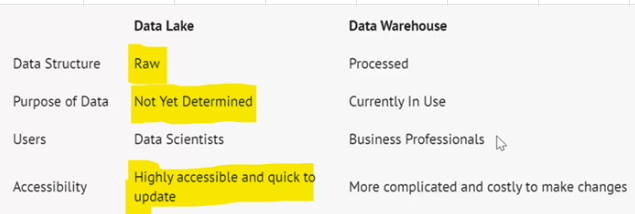
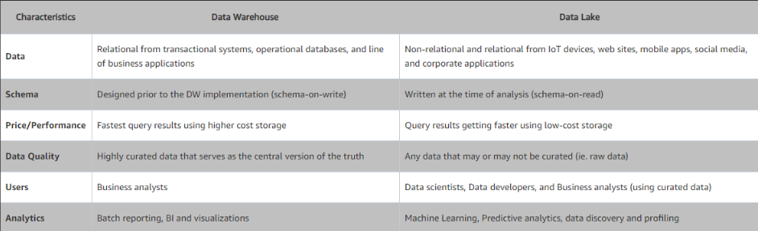
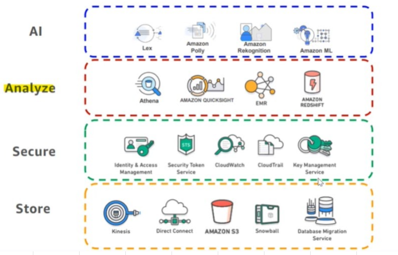

# [Datalake](https://aws.amazon.com/big-data/datalakes-and-analytics/what-is-a-data-lake/)
- Datalake is vast pool of raw data, the purpose of which is not yet defined
- [Building data lake](https://docs.aws.amazon.com/whitepapers/latest/building-data-lakes/building-data-lake-aws.html)

## Datawarehouse
- Datawarehouse is a repository for structured, filtered data that has been processed for a specific purpose
## Data swamp
- Data swamp is a deteriorated and unmanaged datalakethat is either inaccessible to its intended users or is providing little value

## Datalake Vs Datawarehouse

## Datalake layers

