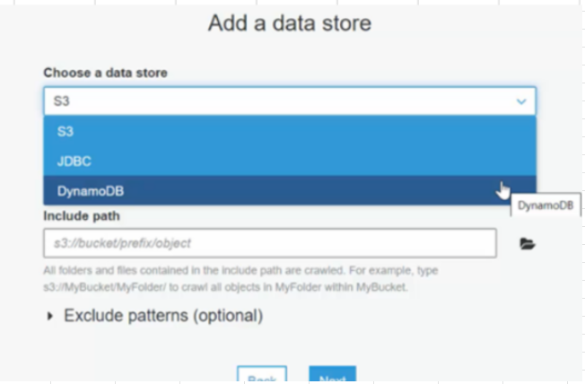
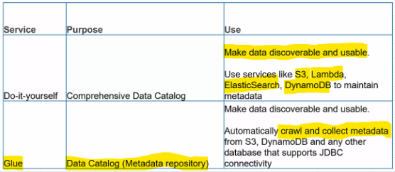

# Discover data

## Data stores
- S3, DynamoDB and other JDBC supported data stores

- Glue supports crawling **Redshift** as well
## Data Catalog
### Glue
- Makes data in data lake easily discoverable and usable

