# Ingest data
- Streaming data with Spark
- On premise data with AWS services
  - Hybrid Connections
    - [Direct Connect](#direct-connect)
  - Bring On Premise data via physical means
    - Storage Gateway
    - Snow ball
    - Storage mobile
  - Data Migration Service
  - Data Pipeline
    - [Task Runner Package for On Premise](#task-runner-package-for-on-premise)
    - Data Pipeline with Amazon Services
      - [AWS RDS](#data-pipeline-with-amazon-rds)
      - [AWS Dynamo DB](#data-pipeline-with-amazon-Dynamodb)
        - ML Use case
- Streaming data with AWS services
  - Kinesis
## 1. Direct Connect
## 2. Storage Gateway	
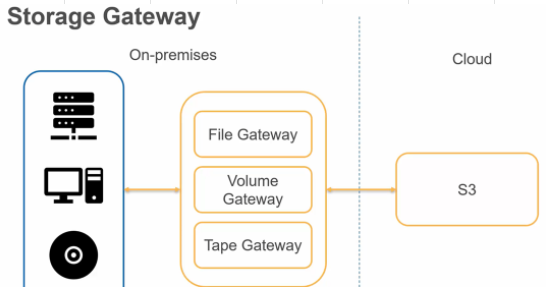

## 3. Snowball
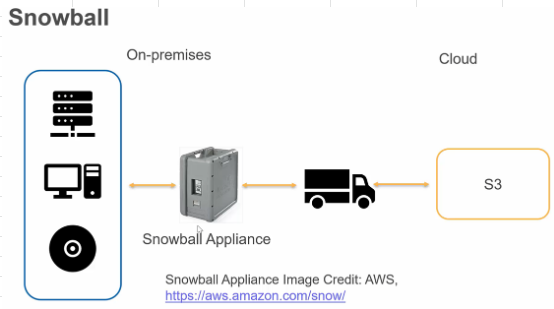

## 4. Snowmobile
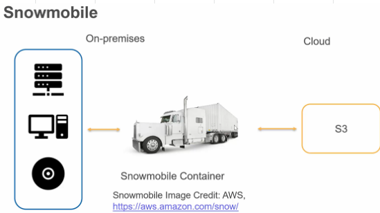

## 5. SDK and CLI
- Software Driven architecture
- SDK and CLI can integrate with other tools as well

## [6. Data Migration Service (DMS)](https://aws.amazon.com/blogs/big-data/loading-ongoing-data-lake-changes-with-aws-dms-and-aws-glue/)
- Migrate Onpremise Databases to AWS
- Enable Continuous Replication via CDC 
  - Change Data Capture: Create a task that captures ongoing changes after you complete your initial (full-load) migration to a supported target data store
- User must create an EC2 to perform replication tasks
- SCT: Schema Conversion Tool
  - OLTP - SQL Server or Oracle To MySQL, PostgrSQL or Aurora
  - OLAP - Teradata or Oracle To Redshift
- DMS also as Migration tool for migrating One AWS DB to another AWS DB (ex: AWS MySQL to AWS Aurora)

## 7. AWS Data Pipeline
- AWS Data Pipeline is a web service that helps you reliably process and move data between 
  - Different AWS compute and storage services, as well as 
  - On-Premises data sources, **at specified intervals.**
- With AWS Data Pipeline, you can regularly 
  - Access your data where it’s stored, 
  - Transform and process it at scale, and 
  - Efficiently transfer the results to AWS services such as Amazon S3, Amazon RDS, Amazon DynamoDB, and Amazon EMR.
- Data Pipeline does not support external MySQL databases. 
  - It only supports the JDBC database, Amazon RDS, and Amazon Redshift.
- AWS Data Pipeline is more suitable for running scheduled tasks.										
- If you need to replicate a database and also want to **load on-going changes**, use AWS DMS										
### Task Runner Package for On Premise
- To enable running activities using on-premise resources, AWS Data Pipeline supplies a Task Runner package that can be installed on your on-premise hosts. 
- This package continuously polls the AWS Data Pipeline service for work to perform. 
- When it’s time to run a particular activity on your on-premise resources, for example, executing a DB stored procedure or a database dump, AWS Data Pipeline will issue the appropriate command to the Task Runner. 
- In order to ensure that your pipeline activities are highly available, you can optionally assign multiple Task Runners to poll for a given job. 
- This way, if one Task Runner becomes unavailable, the others will simply pick up its work.
### Data Pipeline with Amazon RDS
- A Machine Learning Specialist was given access to a SQL Server hosted on Amazon RDS. 
- The data on this database will be used for training a model in Amazon SageMaker. 
- The Specialist intends to design an end-to-end solution to automate his workflow.
- How can the Specialist implement the solution?
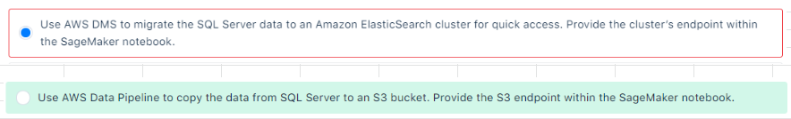

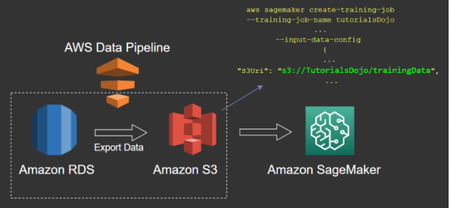

### Data Pipeline with Amazon DynamoDB
- Data Pipeline regularly copies the full contents of a DynamoDB table as JSON into an S3.
- Exported JSON files are converted to comma-separated value (CSV) format to use as a data source for Amazon SageMaker.
- Amazon SageMaker renews the model artifact and updates the endpoint.
- The converted CSV is available for ad hoc queries with Amazon Athena.
- Data Pipeline controls this flow and repeats the cycle based on the schedule defined by customer requirements.
- Data Pipeline can be intergerated with Amazon Redshift as well
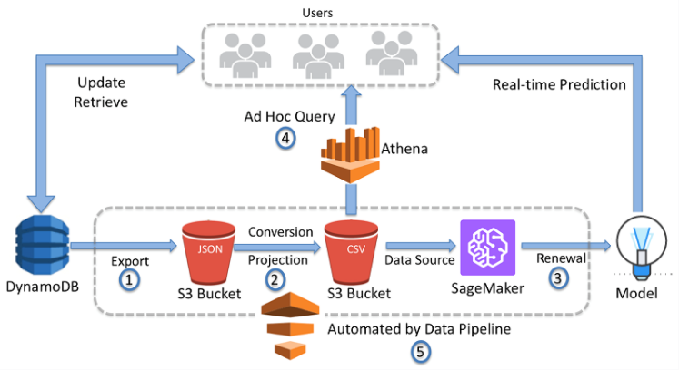

## 8. Streaming Data
- is generated Continuously
- has smaller Payloads
- comes from thousands of sources
### Examples										
- Heart Rate and fitnes monitoring
- In Game player activity
- Social Networking activity
### Kinesis
- Ingests, Buffers and Processes streaming data in real time
#### Real Time Processing of Streaming data										
- Goal is to respond as data arrives
  - Mobile GPS App suggests alternate routes based on traffic jams (It ingests live feed and notices traffic jams)
  - Real Time usage alerts to customer whne usage crosses specified Threshold
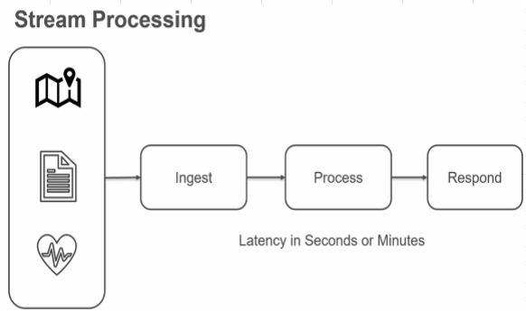

#### Batch Processing of Data/Streaming data										
- Data/Streaming data can be stored in databases or in S3, this data is then analysed by hourly, daily or weekly scheduled jobs
- The batch processing is useful to NOTIFY CUSTOMERS periodically for changes to their accounts
  - Utility Bill Generation
  - Daily/Monthly reports
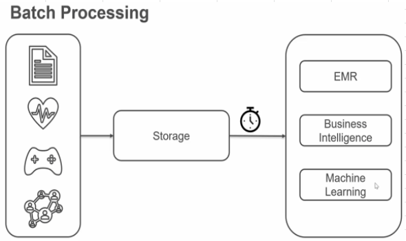

- Sending data via KCL to **EMR for Batch Processing**
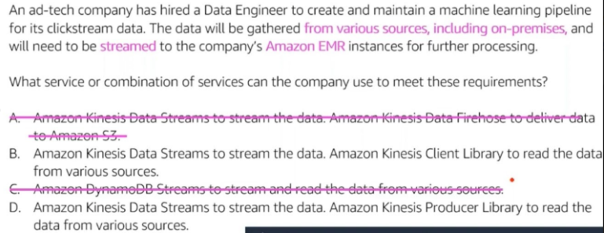

### Services offered by Kinesis
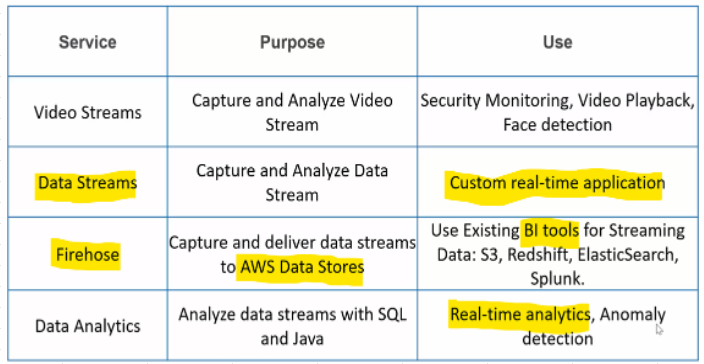

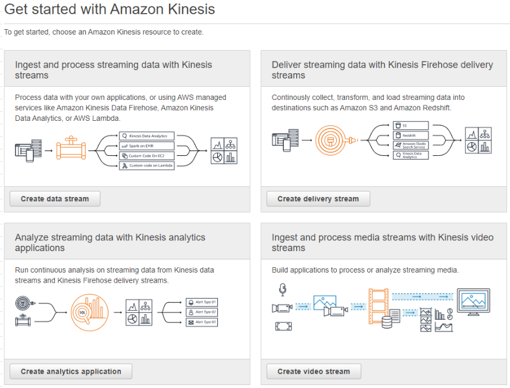

#### Kinesis Data Streams										
- Helps to build custome REAL TIME applications
- Enables to analyse collected data using
  - Kinesis Data Analytics
  - Spark on EMR
  - Custome code on EC2 instances
  - Lambda functions										
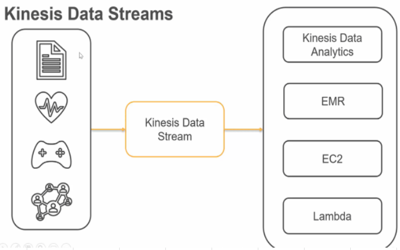

#### Kinesis Data Firehose										
- Enables us to load data into AWS data sources (S3/RedShift/ElasticSearch/Splunk)
- This helps us to analyse streaming data via BI tools			
- Firehose is the easiest option to capture and process data streams
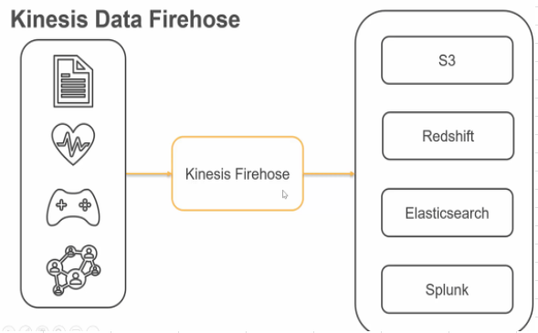

#### Kinesis Data Analytics										
- Enables us to execute queries on Data Streams and Firehose using SQL and 
- Send the processed output to the destination (Databases/File system etc), can be Kinesis Firehose as well.
- Amazon Kinesis Data Analytics enables us to quickly author and run powerful SQL code against streaming sources to 
  - Perform time-series analytics, 
  - Feed real-time dashboards, and 
  - Create real-time metrics.
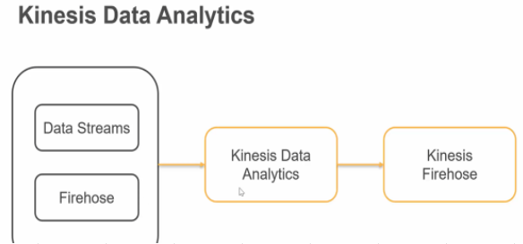

##### Anamoly Detection for Streaming Data with RCF function										
- The Amazon Kinesis Data Analytics RANDOM_CUT_FOREST function detects anomalies in your data stream. 
- A record is an anomaly if it is distant from other records."										
										
##### HotSpots function										
- HotSpots Detection can be used by Kinesis Data Anlaytics,  
- HOTSPOTS function just detects relatively dense regions in your data (NOT ANAMOLIES)

#### Kinesis Video Streams										
- Enables to securely stream videos from Camera equipped devices (CCTV cameras at home/Factory/Public places) to AWS										
- This video can then be used for 										
  - Video Playback										
  - Security Monitoring										
  - Face Recognition										
  - Machine Learning										
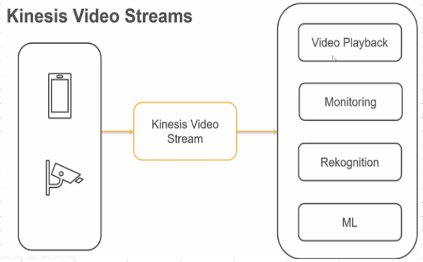

### Ingesting Streaming Data- Question
#### 1. Kinesis- PutRecord API
- [Kinesis Data Streams PutRecord API](https://docs.aws.amazon.com/kinesis/latest/APIReference/API_PutRecord.html) uses name of the stream, a partition key and the data blob whereas 
- [Kinesis Data Firehose PutRecord API](https://docs.aws.amazon.com/firehose/latest/APIReference/API_PutRecord.html) uses the name of the delivery stream and the data record
#### 2. Configuring Shards										
- Shard is the base throughput unit of an Amazon Kinesis data stream. 
- One shard provides a capacity of 
  - 1 MB/sec data input and 
  - 2 MB/sec data output"										
- One shard can support up to 1000 PUT records per second. 
- You will specify the number of shards needed when you create a data stream"										
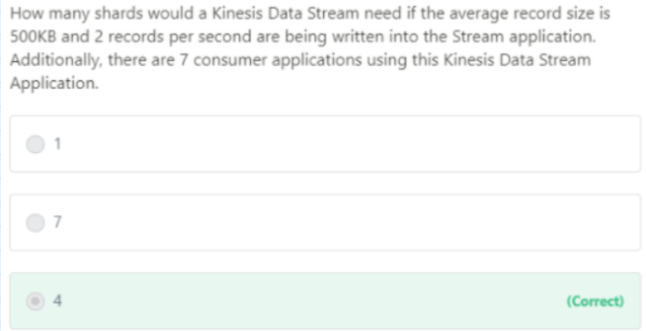

```
number_of_shards = max (incoming_write_bandwidth_in_KB/1000, outgoing_read_bandwidth_in_KB/2000)										
"where
incoming_write_bandwidth_in_KB = average_data_size_in_KB multiplied by the number_of_records_per_seconds. = 500 * 2 = 1000
outgoing_read_bandwidth_in_KB = incoming_write_bandwidth_in_KB multiplied by the number_of_consumers = 1000 * 7 = 7000"										
"So, number_of_shards = max(1000/1000, 7000/2000) = max(1, 3.5) = 4

4 shards are needed to address this use-case"										
```

### Buffering in Kinesis Firehose										
- We can configure the buffer size and buffer interval while creating your delivery stream
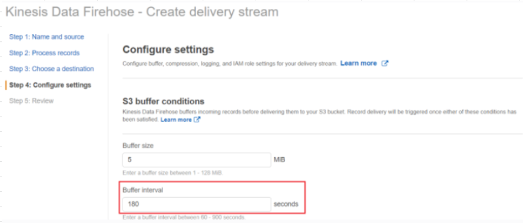

- Buffer size is in MBs and ranges from 1MB to 128MB for Amazon S3 destination and 1MB to 100MB for Amazon Elasticsearch Service destination. 
- Buffer interval is in seconds and ranges from 60 seconds to 900 seconds. 
- Please note that in circumstances where data delivery to destination is falling behind data writing to a delivery stream, Firehose raises buffer size dynamically to catch up and make sure that all data is delivered to the destination.

### KCL for Building Record Processing Application for data coming from IoT devices
- A Data Scientist has been asked to create a pipeline for training machine learning models. 
- The data will be collected from different IoT devices and needs to be read and processed by a custom record-processing application.
- How can the Data Scientist process the data with the least amount of development effort?
- KCL helps you consume and process data from a Kinesis data stream by taking care of many of the complex tasks associated with distributed computing. 
- These include 
  - Load balancing across multiple consumer application instances, 
  - Responding to consumer application instance failures, 
  - Checkpointing processed records, and reacting to resharding. 
- The KCL takes care of all of these subtasks so that you can focus your efforts on writing your custom record-processing logic.
- The KCL is different from the Kinesis Data Streams APIs that are available in the AWS SDKs. 
- The Kinesis Data Streams APIs help you manage many aspects of Kinesis Data Streams, including creating streams, resharding, and putting and getting records. 
- The KCL provides a layer of abstraction around all these subtasks, specifically so that you can focus on your consumer application’s custom data processing logic.
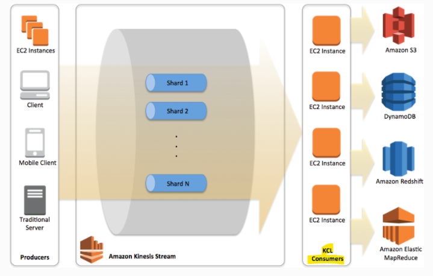

#### KCL for Streaming Data to EMR for processing

