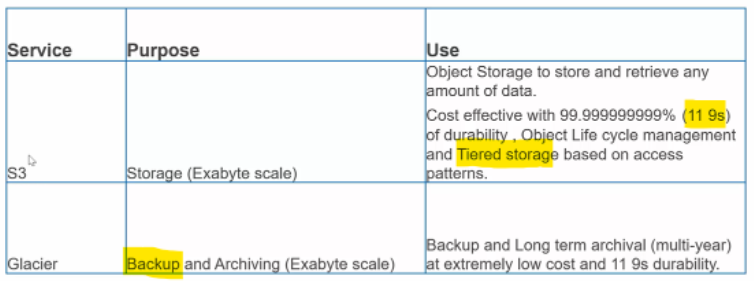
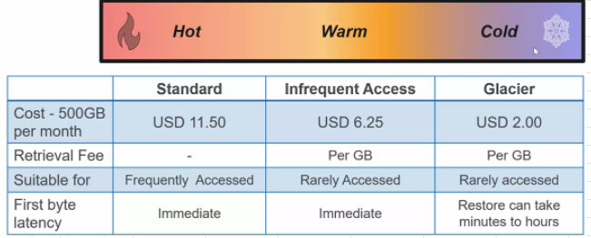
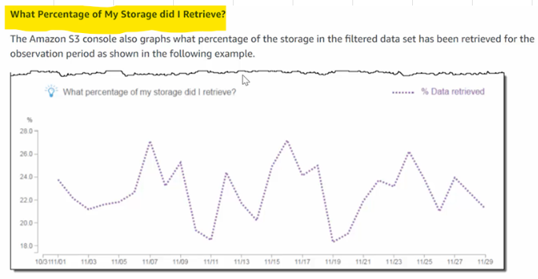
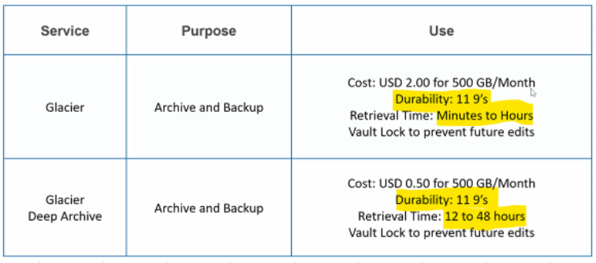

# Optimize data storage
## S3 Vs Glacier

## Cost optimization options
### 1. S3 lifecycle management

#### Lifecycle management rules can be configured based on					
- Object age
- name and folder structure
- S3 object tags
### 2. S3 storage class analysis

### 3. Intelligent tiering
- Objects are automatically moved between frequent access and infrequent access storage class

### 4. Amazon glacier and glacier deep archive

### 5. Data formats
- Use optimal data format like Parquet for storage
