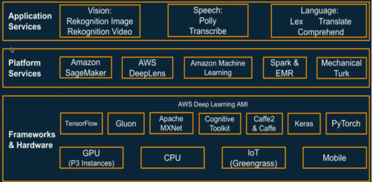

# Data processing
- [Datalake](DataProcessing/Datalake/README.md)
- [Ingest data](DataProcessing/IngestData/README.md)
- [Optimize data storage](DataProcessing/OptimizeDataStorage/README.md)
- [Data formats](DataProcessing/DataFormats/README.md)
- [Discover data](DataProcessing/DiscoverData/README.md)
- [Data transformations](DataProcessing/DataTransformations/README.md)
- [Analyze-Query data](DataProcessing/Analyze-QueryData/README.md)
- [Data engineering](DataProcessing/DataEngineering/README.md)

# [AWS ML and AI](https://tutorialsdojo.com/aws-certified-machine-learning-specialty-exam-study-path/)

# Sagemaker
- [Data pre-processing](Sagemaker/DataPreProcessing/README.md)
- [Training](Sagemaker/Training/README.md)
- [Model setup](Sagemaker/ModelSetup/README.md)
- [Model hosting](Sagemaker/ModelHosting/README.md)
- [Hyperparameter tuning](Sagemaker/HyperParameterTuning/README.md)
- [Inference](Sagemaker/Inference/README.md)
- [Monitor model and retraining](Sagemaker/MonitorModel-Retraining/README.md)
- [Model invokation via external clients](Sagemaker/ExternalClients-ModelInvokation/README.md)
- [Monitoring](Sagemaker/Monitoring/README.md)
- [Securing and protecting data](Sagemaker/SecuringAndProtectingData/README.md)
- [Miscellaneous](Sagemaker/Miscellaneous/README.md)
