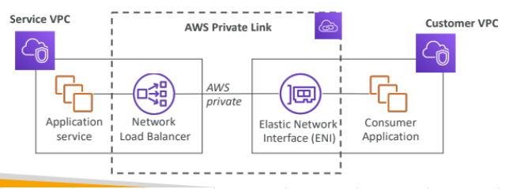
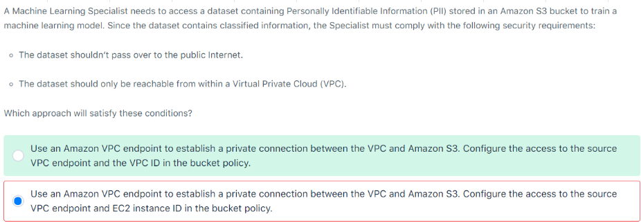
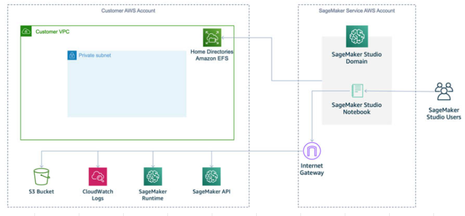
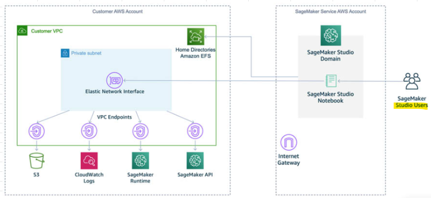

# Model Invocation via Lambda										
- To streamline access to the backend services, you can API Gateway. 
- You can use API Gateway as a Gatekeeper to ensure only authorized users and applications have access to the services.
- Configure API Gateway to invoke the Lambda function.  
- Lambda function, in turn, invokes SageMaker endpoint.  
- You need to configure Autoscaling to ensure SageMaker endpoint scales on demand.  	
- This approach also makes it easy to try different versions of Machine Learning Models without requiring code changes in the client application.										
										
## 1. While invoking model with Lambda, choose "amount of memory needed to execute your function"										
### Question
- You are using a lambda function to invoke SageMaker Endpoints.  
- This function can accept a batch of records as input and returns the list of predicted values.  
- You are testing a new model that requires compute-intensive pre-processing of incoming data.  
- You want to use a higher-performing instance for your lambda function.  
- What option does AWS provide to improve performance?
### Solution
- With Lambda, you must choose the amount of memory needed to execute your function.
- Based on the memory configuration, proportional CPU capacity is allocated.
- You can also increase the timeout for up to a maximum of 15 minutes."										
- With Lambda, we do not choose EC2 instance type instead we choose  amount of memory needed to execute your function.										

## Private link										
- The SageMaker API and Runtime support Amazon Virtual Private Cloud (Amazon VPC) interface endpoints that are powered by AWS PrivateLink. 
- Each VPC endpoint is represented by one or more Elastic Network Interfaces with private IP addresses in your VPC subnets."										
										
### Overview PrivateLink										
- Step 1: Create NLB in Service VPC (NLB acts as an Endpoint to the service being exposed to another/Customer VPC)
- Step 2: Create VPC endpoint in Customer VPC (search for the exposed service which is NLB created in service account, **"Find service by name"** option)
- This Creates an ENI in Customer VPC as we have created an Interface endpoint

#### 1. Secure SageMaker model endpoints via AWS PrivateLink			
- SageMaker supports Amazon VPC Interface endpoints powered by AWS PrivateLink for private connectivity between the customer's VPC and the request router to access hosted model endpoints

#### 2. Bucket Policy will include VPC endpoint and VPC ID

- VPC endpoint and EC2 instance ID is INCORRECT because access should encompass the whole VPC and not be limited to only a particular EC2 instance.										

## Via-InternetGateway
- Accessing Resources via Sagemaker Studio										
- We access
  - SageMaker API or to the 
  - SageMaker Runtime 
  - S3 bucket
  - Cloudwatch logs etc **through an Internet Gateway connecting over the internet**

## Via-PrivateLink
- VPC Private Link: **Interface Endpoint**
- Sagemaker Studio Users will connect to AWS resources such as:
  - SageMaker API or to the 
  - SageMaker Runtime 
  - S3 bucket
  - Cloudwatch logs etc **through an interface endpoint securely without using Internet Gateway**
- Interface Endpoint will create an ENI, Connections to AWS resources will be made via this ENI instead of Internet Gateway										
- The VPC interface endpoint connects your VPC (Service AWS account) directly to the AWS Services without an internet gateway, NAT device, VPN connection, or AWS Direct Connect connection.
- The instances in your VPC don’t need public IP addresses to communicate with the SageMaker API or Runtime"										
# 