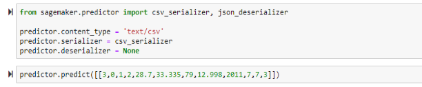
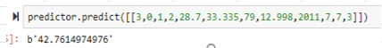

# Inference

## Real time inference										
- Call predict method										
										
## [Batch Transform](https://docs.aws.amazon.com/sagemaker/latest/dg/ex1-batch-transform.html)
- Call `sagemaker.transformer.Transformer` object										
- The constructor argument `output_path` takes the location in S3 where you want to store the inferences										
										
- Distractor										
  - What measures you would take to make sure that in Batch mode the data is protected in-transit even for inter-node training communications?										
  - There are no inter-node communications for batch processing, so inter-node traffic encryption is not required. 										
										
## [Elastic Inference for DL models](https://docs.aws.amazon.com/sagemaker/latest/dg/ei.html)
- Elastic Inference accelerates inference by allowing you to attach fractional GPUs to any SageMaker instance
- For DL models, Amazon Elastic Inference (EI) speeds up the throughput and decrease the latency of getting real-time inferences
-  Elastic Inference helps you lower your cost when not fully utilizing your GPU instance for inference"										
- Frameworks supporting EI
  - MxNet
  - Tensorflow
  - PyTorch
	
## Run Predictions

## [Inference Pipeline](https://docs.aws.amazon.com/sagemaker/latest/dg/inference-pipelines.html)
- You can use an inference pipeline to combine preprocessing, predictions, and post-processing data science tasks. 
- Inference pipelines are fully managed.
- You use an inference pipeline to
  - Define and deploy any combination of pre-trained SageMaker built-in algorithms and 
  - Your own custom algorithms packaged in Docker containers. "										
- Inference Pipeline is composed of a linear sequence of two to five containers to process requests for inferences on data. 										
- The entire assembled inference pipeline can be considered as a SageMaker model that you can use to make either real-time predictions or to process batch transforms directly without any external preprocessing										
- Within an inference pipeline model, Amazon SageMaker handles invocations as a sequence of HTTP requests (NOT as HTTPS)										
										
### [Preprocessing data and Inference Pipeline](https://aws.amazon.com/blogs/machine-learning/preprocess-input-data-before-making-predictions-using-amazon-sagemaker-inference-pipelines-and-scikit-learn/)
- You can add SageMaker Spark ML Serving and Scikit-learn containers that reuse the data transformers developed for training models.										

## Finding best model
### How to configure Best Model										
- Perform Hyperparameter tuning										
- Visualize the correlation of the eta, alpha, max_depth, and min_child_weight hyperparameters with the model’s performance at each iteration										
  - For Classification models generate a scatter plot of hyperparametrs Vs AUC metric										
  - For Regression models generate a scatter plot of hyperparametrs Vs RMSE metric										
										
### [Good Example](https://aws.amazon.com/blogs/machine-learning/ensure-consistency-in-data-processing-code-between-training-and-inference-in-amazon-sagemaker/)

## [Model Registry](https://docs.aws.amazon.com/sagemaker/latest/dg/model-registry.html)
- Catalog models for production.
- Manage model versions
- Associate metadata, such as training metrics, with a model.
- Manage the approval status of a model					
- Deploy models to production.
- Automate model deployment with CI/CD.										