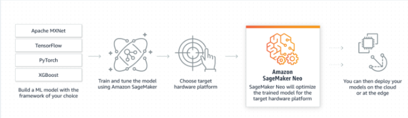
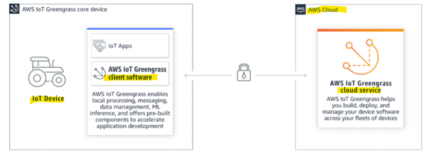
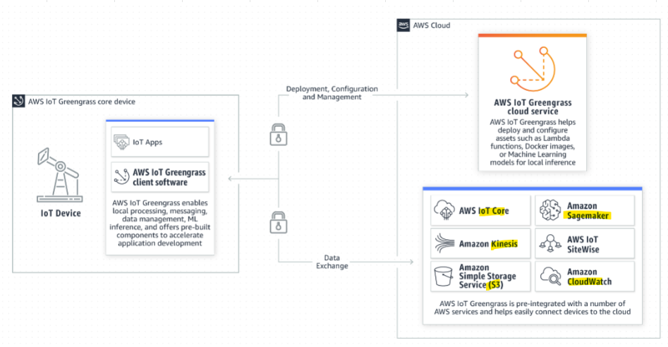
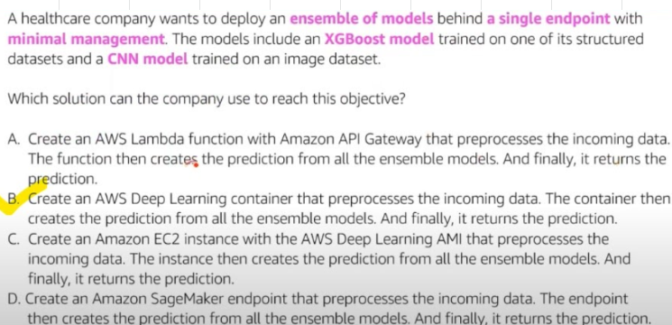
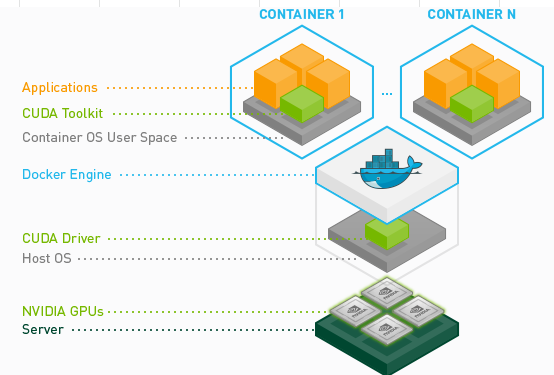

# 

## [SageMaker Ground Truth](https://aws.amazon.com/sagemaker/groundtruth/faqs/)
- AWS Ground Truth is used for **Labelling data**
- Labeling data is a tedious tsk, AWS Ground Truth helps in this use case by 										
  - Automatic labelling										
    - Give some examples to Ground Truth, it will then automatically label the data										
    - Very Cost Effective										
  - Manual/Human performed labelling										
    - Distributes labelling task to market place (-Mechanical Turk)										
    - Ground Truth will manage the workflow										
										
### 1. Automatic Labelling with Ground truth saves cost										
- A Machine Learning Specialist has received 20,000 unlabeled images to train an object detection model. 
- The Specialist has currently a team of 5 human labelers. 
- Due to resource and budget constraints, the Specialist chooses to leverage a trained labeling model from a previous job to annotate the images.
- Which is the BEST course of action to label the images?"										
### Solution
- Label the dataset using the trained model and send those images with a low-confidence score to Amazon S3. 
- Then, have Amazon SageMaker Ground Truth label them.
- Outsource the labeling task from Amazon Mechanical Turk. 
- Use the trained model to verify labeled images with high-confidence scores. 
- Finally, use only high-quality data to train the object detection model, because this would introduce additional costs to the current solution
										
### 2. How to baseline "Human Level" performance										
- Newly trained employees had a misclassification error rate of 5%, 
- Experienced employee had an error rate of 2.5%, and 
- When a team of experienced employees worked together, they had a misclassification rate of 1%.
#### Solution
- 1% should be used as the human-level performance and it is a good proxy for Bayes optimal error (theoretical best possible error rate).										
- Reference: NIPS 2016 tutorial: [Nuts and bolts of building AI applications by Dr. Andrew Ng](https://www.youtube.com/watch?v=wjqaz6m42wU) (Starting at 1:24:00)

## SageMaker NEO
- Neo Supports Image Classification Models										
- Amazon SageMaker Neo enables developers to optimize machine learning (ML) models for inference on 
  - SageMaker in the cloud and 
  - Supported devices at the edge **with low latency**								
### Scenario
- ML inference is the process of using a trained machine learning model to make predictions. 										
- After training a model for high accuracy, developers often spend a lot of time and effort tuning the model for high performance.										
- For inference in the cloud, developers often turn to large instances with lots of memory and powerful processing capabilities at higher costs to achieve better throughput. 										
- For inference on edge devices with limited compute and memory, developers often spend months hand-tuning the model to achieve acceptable performance within the device hardware constraints										
										
#### Solution										
- Amazon SageMaker Neo automatically optimizes machine learning models for inference on cloud instances and edge devices to run faster with no loss in accuracy										
- You start with a machine learning model already built with DarkNet, Keras, MXNet, PyTorch, TensorFlow, TensorFlow-Lite, ONNX, or XGBoost and trained in Amazon SageMaker or anywhere else. 										
- Then you choose your target hardware platform, which can be a SageMaker hosting instance or an edge device based on processors from Ambarella, Apple, ARM, Intel, MediaTek, Nvidia, NXP, Qualcomm, RockChip, Texas Instruments, or Xilinx										
- With a single click, SageMaker Neo optimizes the trained model and compiles it into an executable										
- The compiler uses a machine learning model to apply the performance optimizations that extract the best available performance for your model on the cloud instance or edge device										
- You then deploy the model as a SageMaker endpoint or on supported edge devices and start making predictions.										
										
#### Benefits										
- For inference in the cloud, SageMaker Neo speeds up inference and saves cost by creating an inference optimized container in SageMaker hosting			
- For inference at the edge, SageMaker Neo saves developers months of manual tuning by automatically tuning the model for the selected operating system and processor hardware										

### Questions
#### 1. How do we classify the images of marine life forms in an autonomous way with low latency?										
- In This case we need to make Inference/Prediction/Classification at the Edge, hence SageMaker Neo provides the correct local solution with low latency for this under water use case										

#### 2. Support for Androids on ARM based processors and Qualcom processors with Hexagon DSP										
- Lets say we have completed training on a deep learning model built with Apache MXNet on Amazon SageMaker. 
- Now we want to compile and deploy this model to an ARM-based android phone for inference
- Amazon SageMaker Neo automatically optimizes machine learning models for inference on cloud instances and edge devices to run faster with no loss in accuracy. 
- You start with a machine learning model already built with DarkNet, Keras, MXNet, PyTorch, TensorFlow, TensorFlow-Lite, ONNX, or XGBoost and trained in Amazon SageMaker or anywhere else.

- It has support for Windows on x86 processor-based devices, allowing you to run your models faster and more efficiently on personal computers and other Windows devices. 
- In addition, Neo also supports Androids on ARM-based processors and Qualcomm processors with Hexagon DSP.

## IoT Greengrass
- AWS IoT Greengrass is an Internet of Things (IoT) open source edge runtime and cloud service that helps you build, deploy, and manage device software.
- You can program your devices to 
  - act locally on the data they generate, 
  - execute predictions based on machine learning models, 
  - filter and aggregate device data, and 
  - only transmit necessary information to the cloud.
- AWS IoT Greengrass enables 
  - Local processing, 
  - Messaging, 
  - Data management, 
  - ML inference, and 
  - Offers pre-built components to accelerate application development.
- AWS IoT Greengrass also provides a secure way to seamlessly connect your edge devices to any AWS service as well as to third-party services.		
- v. Once software development is complete, AWS IoT Greengrass enables you to remotely manage and operate software on your devices in the field without needing a firmware update.
- AWS IoT Greengrass helps keep your devices up-to-date and makes them smarter over time.
### Components
- Greengrass Client Software on IoT Device										
- Greengrass Cloud service: Helps to build, deploy and manage IoT device software across fleet of devices										

### Pre Integration with other AWS services

## Deep Learning AMIs
- Launch EC2 instances preconfigured with all the tools and Deep Learning Framework
- Modify DL frameworks or extend them
- Contributors to DL frameworks
- Troubleshooting framework level issues

## NVIDIA-GPUs for model training
- How to configure the container to use NVIDIA GPUs for model training?					
- The NVIDIA Container Toolkit allows users to build and run GPU accelerated Docker containers. 
- The toolkit includes a container runtime library and utilities to automatically configure containers to leverage NVIDIA GPUs.

- In Amazon SageMaker, if you plan to use GPU devices for model training, make sure that your "containers are nvidia-docker compatible"
- Only the CUDA toolkit should be included on containers, don’t bundle NVIDIA drivers with the image.
### NVIDIA Deep Learning AMI
- This is an optimized environment for running GPU-optimized deep learning models

