# Hosting Options

## Deploy for Real time predictions
- Realtime endpoint for interactive and low-latency use cases
## Deploy for Batch transforms
- Batch transform for non-interactive use cases
  - Non Interactive use case: You want to generate Predictions for millions of records stored in a file
- Suitable for these scenarios:
  - Inference for your entire dataset
  - Dont need a persistent real-time endpoint
  - Dont need a sub second latency performance
- Sagemaker manages resources for batch transform
### [Workflow of batch transform](https://docs.aws.amazon.com/sagemaker/latest/dg/how-it-works-batch.html)
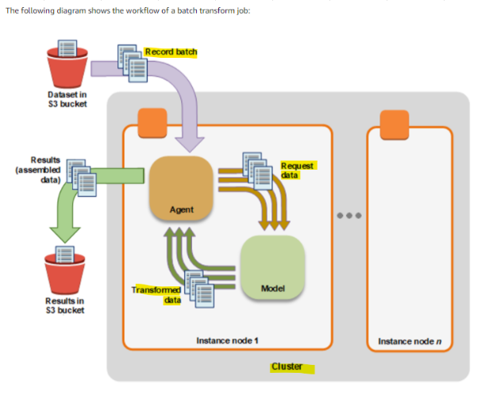

### Performing batch transform
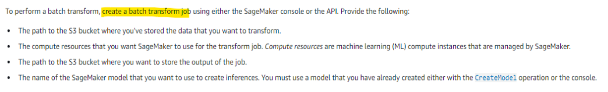

## Benefits of hosting model with Sagemaker
- Autoscaling
  - Maintain adequate capacity
  - Replace unhealthy instances
  - Dynamically scale-out and scale-in based on workload
- Test multiple variants of a model
### Model Hosting with CloudWatch and Auto Scaling
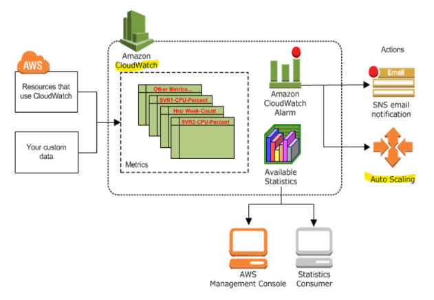

### [Cloudwatch metrics for Sagemaker](https://docs.aws.amazon.com/sagemaker/latest/dg/monitoring-cloudwatch.html)
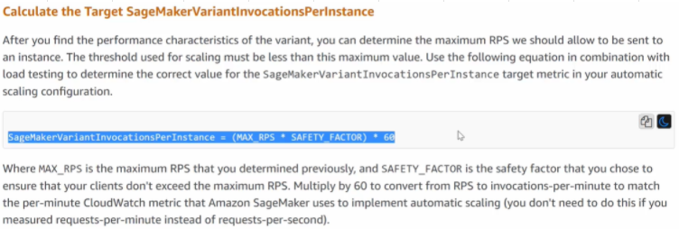

### SageMakerVariantInvocationsPerInstance 										
- SageMakerVariantInvocationsPerInstance is a per minute metric that you can monitor with CloudWatch to trigger Auto Scaling actions										
```
SageMakerVariantInvocationsPerInstance = (MAX_RPS * SAFETY_FACTOR) * 60
```
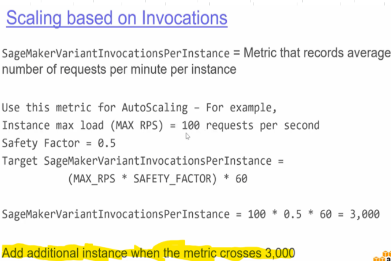

## [Deploy model](https://github.com/sbhrwl/aws/blob/main/2.AI/Sagemaker/ModelSetup/README.md#deploy-the-model)
## Hosting options
### Endpoint with One Instance
- In this case if our Instance becomes unhealthy, Auto scaling will launch a new Instance
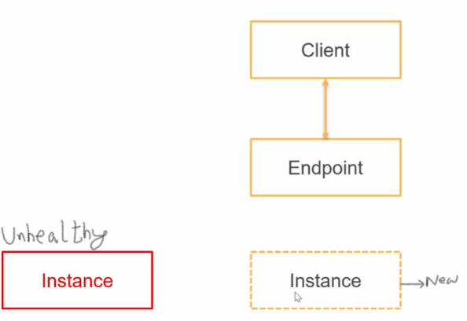

- Drawbacks
  - The model will not be available to client applications untill the new replacement Instance is launched										
  - Hence we host our Model with Multiple Instances

### Configuring Multiple Instances at an Endpoint
- Multiple Instances can be configured to offers Load Balancing as well
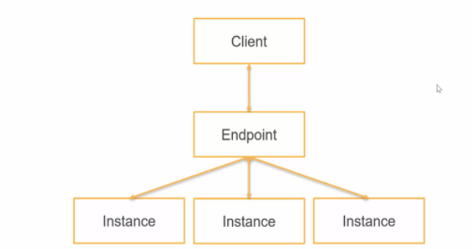

- This set up can Handle AZs failure as well
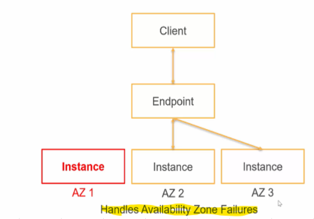

### Scaling on Demand	
- Configure Auto scaling to handle needed Scaling on demand					
- Add more instances when the demand reaches threshold (configure auto scaling), take out instances when demand goes down
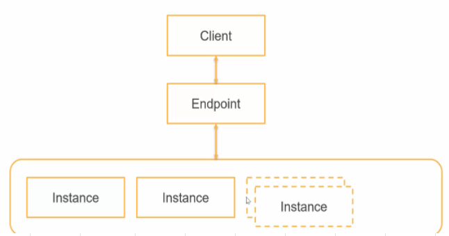

## [Multi Model Endpoint](https://docs.aws.amazon.com/sagemaker/latest/dg/multi-model-endpoints.html)
- Multi-model endpoints are fully managed and highly available to serve traffic in real-time. 
- You can easily invoke a specific model by specifying the target model name as a parameter in your prediction request					
- Multi-model endpoints provide a scalable and cost-effective solution to deploying large numbers of models.										
- They use a shared serving container that is enabled to host multiple models. 
- This reduces hosting costs by improving endpoint utilization compared with using single-model endpoints. 
- It also reduces deployment overhead because Amazon SageMaker manages loading models in memory and scaling them based on the traffic patterns to them
- Multi model endpoints are good options for Offering HA

### Cost Comparison: Separate Endpoint for each Model VS Multi Model Endpoint
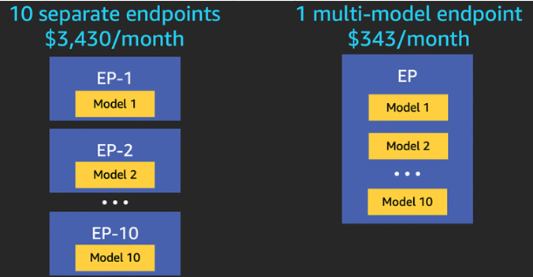

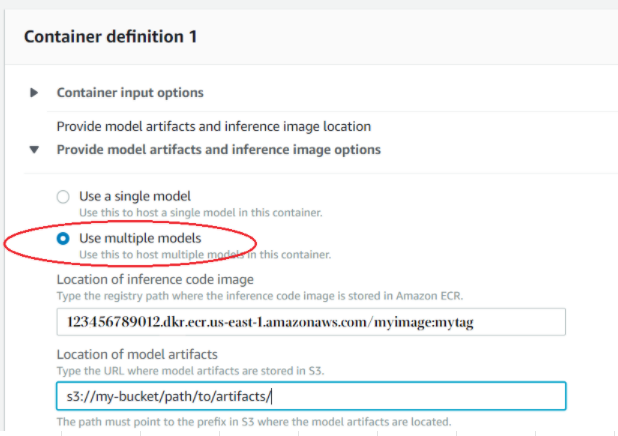

#### Remember
- Endpoint is the EC2 Instance on which Sagemaker will 
  - Deploy the TRAINED MODEL (model.tar.gz file) and 
  - Enable us to perform Predictions against the trained Model"										
- When using Multi Model Endpoint, we deploy Multiple Models on same EC2, resulting in cost optimization and effective use of resources

### Add model to existing endpoint
- Copy a new Model artifacts to the Amazon S3 location there you store your models										
```
# Add an AdditionalModel to the endpoint and exercise it
aws s3 cp AdditionalModel.tar.gz s3://my-bucket/path/to/artifacts/
```
- Client applications can request predictions from the additional target model as soon as it is stored in S3					
```
response = runtime_sm_client.invoke_endpoint(
                        EndpointName='endpoint_name',
                        ContentType='text/csv',
                        TargetModel='AdditionalModel.tar.gz',
                        Body=body)
```
### [Multi-container endpoints](https://docs.aws.amazon.com/sagemaker/latest/dg/inference-pipeline-create-console.html)
- The containers can be run in a sequence as an Inference Pipeline, or 
- Each container can be accessed individually by using Direct Invocation to improve endpoint utilization and optimize costs

## Hosting multiple algorithms
### Hosting Different Versions of a Model or Algorithm
- Send 90% of the traffic to Version1 of Algorithm and 10% of the traffic to Version2 of Algorithm
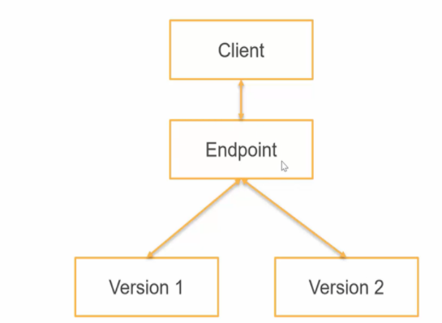

### [AWS Sagemaker Endpoint](https://aws.amazon.com/blogs/machine-learning/a-b-testing-ml-models-in-production-using-amazon-sagemaker/)
- Amazon SageMaker enables you to test multiple models or model versions behind the same endpoint using production variants. 
- Each ProductionVariant identifies an ML model and the resources deployed for hosting the model.
- You can distribute endpoint invocation requests across multiple production variants by providing the traffic distribution for each variant or invoking a variant directly for each request.
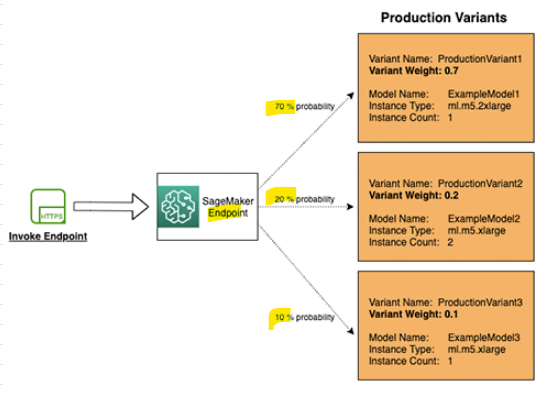

- To test multiple models by distributing traffic between them, specify the percentage of the traffic to route to each model by specifying the weight for each production variant in the endpoint configuration. 
- Amazon SageMaker distributes the traffic between production variants based on the respective weights that you provided. 
- Once you’re happy with the model that has the best performance, you can reroute 100% of the traffic to it.
- Use case: **A/B-Testing**

### Example
- Create 2 Production variants, to split requests evenly set "initial_weight as 0.5"
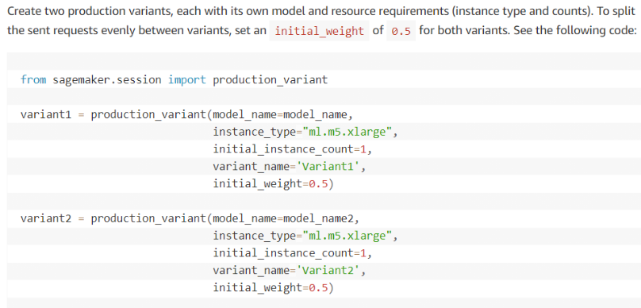

- Deploy these production variants on an Amazon SageMaker endpoint with the following code
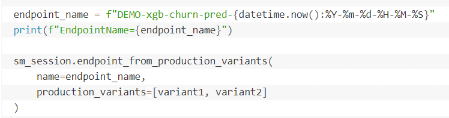

- Invoke Endpoint
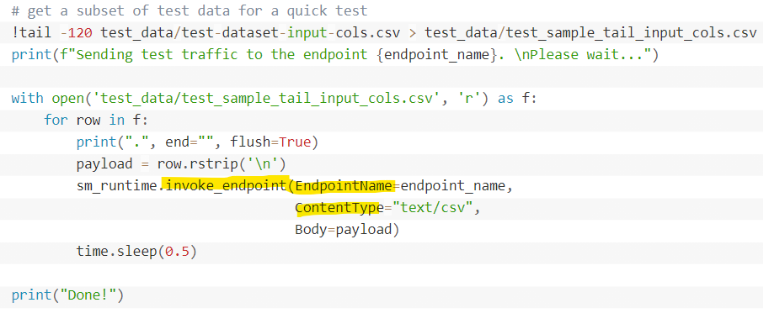
