# Using SageMaker for Model Training with XGBoost						
- Step 1	Upload Train, Validation and Test files to S3					
- Step 2	Select Algorithm Container Registry Path (Path varies by region)					
- Step 3	Configure Estimator (EC2 Instance) for training					
- Step 4	Specify algorithm specific hyper parameters					
- Step 5	Specify Channels					
- Step 6	Train/Fit the Model					
- Step 7	Deploy Model to the Endpoint (EC2 Instance)					
- Step 8	Run Predictions on the Endpoint					

## Upload Train, Validation and Test files to S3
### 1. Import Standard libraries and Sagemaker SDK
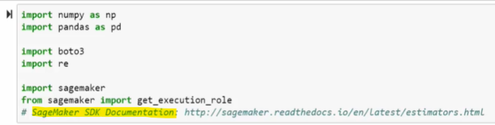

### 2. write_to_s3
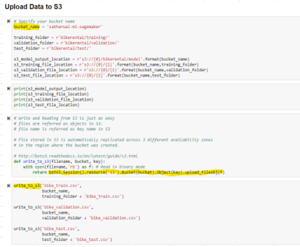

### 3. Verify files in S3 Bucket		
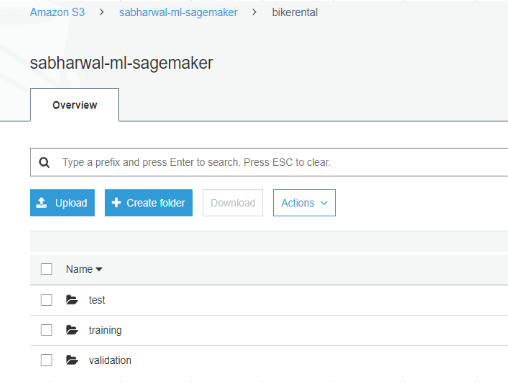

## Algorithm Setup
### 1. Establish a session with AWS and Get execution role				
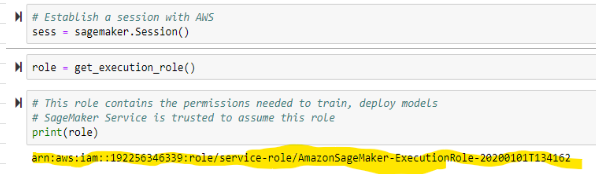

- **The above IAM role is derived from the user with which we logged in to work on sagemaker jupyter notebook instance**
- Note
  - IAM Role should have 										
    - Access to S3 bucket										
    - Access to spin up new instances to TRAIN the model and to store the trained model artifacts										

### 2. Get Image Registry path		
- Sagemaker maintains all the Algorithms as Docker Containers and these containers are stored in [Elastic Container Registry](https://docs.aws.amazon.com/sagemaker/latest/dg/sagemaker-algo-docker-registry-paths.html) 
  - ECR ~ Docker Hub
- ECR is regional service and Algorithm path is different for each region
- SageMaker maintains a separate image for algorithm and region
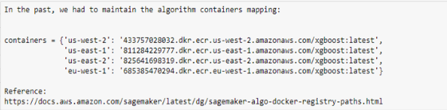

- Sagemaker now provides lookup capability with **get_image_uri** method, Specify										
  - Region										
  - Algorithm										
  - Version Tag (:1/latest)										
- get_image_uri method returns correct Registry path		
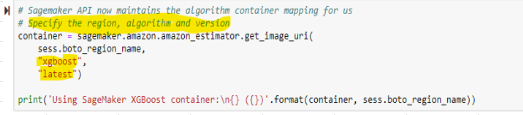

### 3. Note down the Algorithm Path
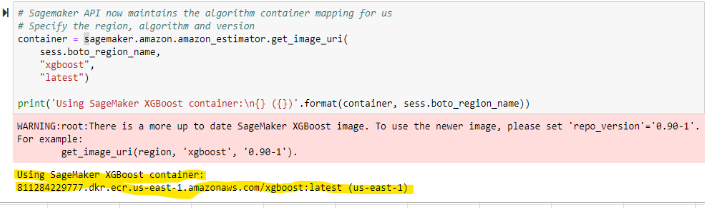

## Configure Estimator for Training
- Estimator is the EC2 Instance on which Sagemaker will 
  - Deploy the Algorithm (Algorith path from previous step) and 
  - Perform training of the data
										
#### Create an Instance of Estimator										
- Use method sagemaker.estimator.Estimator and specify										
  - Algorithm Container to use										
  - Role to use										
  - Number of instances to use										
  - Type of instance to use										
  - Location of Trained model artifacts (output) on S3										
  - Sagemaker session										
  - Base job name
  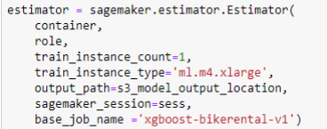
  
## Specify Hyper Parameters		
### Configure Hyperparameters		
- Use method set_hyperparameters								
  - max_depth: Depth of Tree										
  - objective: BikeRental problem is regression problem										
  - eta: Learning rate										
  - num_round: Number of Trees										
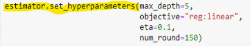

- Estimator instance with hyper parameters			
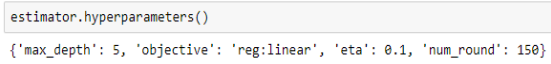

## Specify Channels
### Configure Channels
- In Sagemaker terminology, Location of Data files is termed as Channels										
- Training Channel points to Training folder in S3										
- Validation Channel points to Validation folder in S3										
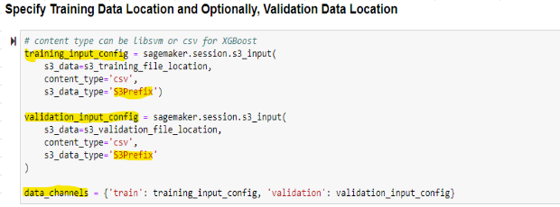

- S3_Data_Type as **S3Prefix** implies that the provided path is a "Prefix" and not actual file name 										
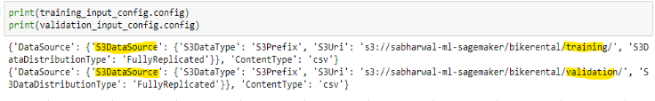

## Train/Fit the Model
### 1. Train
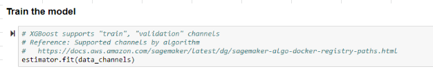

### 2. What happens during Fit process?
- Training Instance is launched										
- Algorithm Container Image is downloaded from ECR										
- Container Image is deployed to the Training Instance										
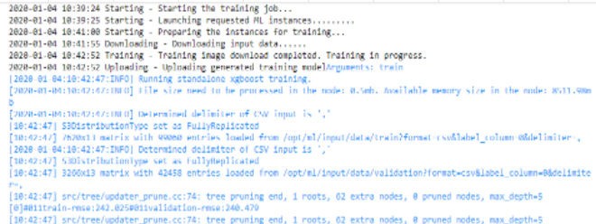

- iv. Model fits and calculates RMSE for each Tree
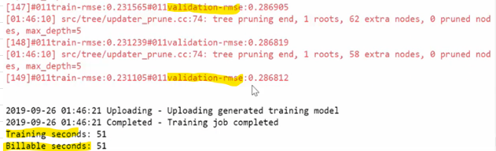

### 3. Verify Training Job on console
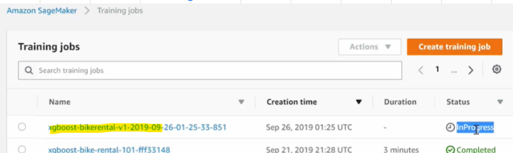

## Deploy the Model
- Endpoint is the EC2 Instance on which Sagemaker will 
  - Deploy the TRAINED MODEL (model.tar.gz file) and 
  - Enable us to perform Predictions against the trained Model
### Deploy Model to the Endpoint		
Specify
- Instance Count										
- Instance Type
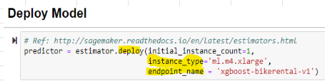

- Based on above specified parameters, 
  - Sagemaker will spin up the required number of instances, 
  - Host the Model on instances and 
  - Create an Endpoint.
- Endpoint will be used to make predictions
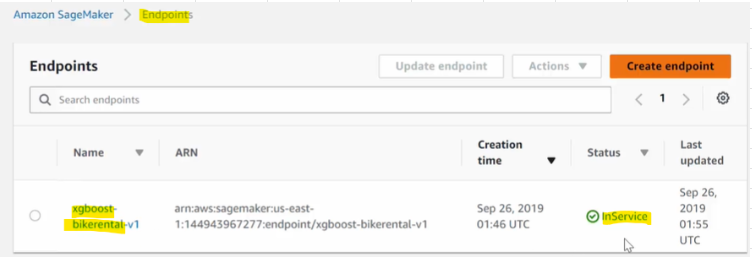

### [Model Hosting: 3 Step Process](https://docs.aws.amazon.com/sagemaker/latest/dg/how-it-works-deployment.html)
- Create a model in SageMaker, 
- Create an endpoint configuration for an HTTPS endpoint and 
- Create an HTTPS endpoint

## Run Predictions
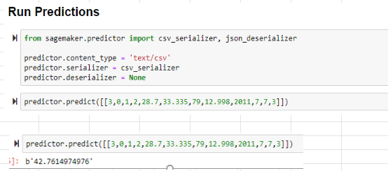

## Connect to an existing endpoint for making predictions

