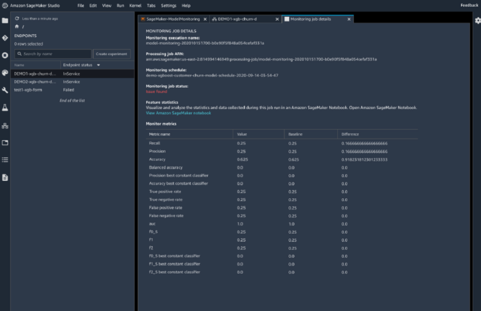

# DevOps VS MLOps	

## Auto Pilot-AutoML
- Auto Pilot~MlFlow										
- Autopilot automates key tasks of an automatic machine learning (AutoML) process.										
- Autopilot 
  - Explores your data, 
  - Selects the algorithms relevant to your problem type, and 
  - Prepares the data to facilitate model training and tuning.
- Autopilot simplifies your machine learning experience by automating these key tasks that constitute an AutoML process. 
- Autopilot ranks all of the optimized models tested by their performance. 
- Autopilot finds the best performing model that you can deploy at a fraction of the time normally required

### Create Autopilot Experiment

### AutoPilot Generated Inference Containers			

## [Model Drift](https://docs.aws.amazon.com/wellarchitected/latest/machine-learning-lens/evolve.html)
- ML workloads can initially provide high-value predictions but the accuracy of that same model’s predictions can degrade over time										
- Often this is due to a concept known as drift, which can be a result of many factors that include changes to ground truth data over time										
- As model predictions are integrated into business decisions, this can indirectly affect the performance of existing models.										
- For example, take a retail scenario predicting the risk associated with a particular shipment, where the training data includes past damaged shipments. 
- As the business starts using the model to make business decisions, this indirectly affects the data as there will be fewer instances of damaged products.

### Retraining the Model Code Pipeline										
- There is often a need to retrain a model using new or updated data to ensure that the model is able to effectively learn and predict based on the most current data available.										
- To be able to effectively incorporate additional data into an ML model, there must be a mechanism implemented to analyze existing model performance against defined metrics and trigger an alarm or a retraining event when model variance reaches a specific threshold, or proactively retrain the model over time based on new known data.										
- Retrain the model periodically using the original and the new data whenever a significant change in customer data is detected.										

### Change in data distribution would lead to Model Drift and hence Model Deterioration										
- For a model to predict accurately, the data that it is making predictions on must have a similar distribution as the data on which the model was trained. 
- Because data distributions can be expected to drift over time, deploying a model is not a one-time exercise but rather a continuous process. 
- It is a good practice to continuously monitor the incoming data and retrain your model on newer data if you find that the data distribution has deviated significantly from the original training data distribution.
- If monitoring data to detect a change in the data distribution has a high overhead then a simpler strategy is to train the model periodically, for example, daily, weekly, or monthly. 
- In order to retrain models in Amazon ML, you would need to create a new model based on your new training data

## Model deterioration	
- An Analytics Consulting Firm wants you to review a Classification Model trained on historical data and deployed about 6 months ago. 
At the time of deployment the model performance was upto the mark. Post deployment, the model has not been retrained on the incremental data coming in every day. 
- Now the model performance has gone down significantly. As an ML Specialist, what is your recommended course of action:"										
### 
- This is an example of model deterioration because the training data has aged. 
- The solution is to retrain the model using the historical data along with the data for the last 6 months"										

- Incremental Training with last 6 months of data will not improve performance of the Model										

## [SageMaker Model Monitor](https://aws.amazon.com/sagemaker/model-monitor/)
- Amazon SageMaker Model Monitor continuously monitors the quality of Amazon SageMaker machine learning models in production.										
- With Model Monitor, you can set alerts that notify you when there are deviations in the model quality.										
- Early and proactive detection of these deviations enables you to take corrective actions, such as 
  - Retraining models, 
  - Auditing upstream systems, or 
  - Fixing quality issues without having to monitor models manually or build additional tooling.
### Types of Monitoring	
- Monitor Data Quality - Monitor drift in data quality.										
- Monitor Model Quality - Monitor drift in model quality metrics, such as accuracy										
- Monitor Bias Drift for Models in Production - Monitor bias in you model's predictions										
- Monitor Feature Attribution Drift for Models in Production - Monitor drift in feature attribution										

## How Model Monitoring works?										
- Enable the endpoint to capture data from incoming requests to a trained ML model and the resulting model predictions										
- Create a baseline from the dataset that was used to train the model. 
  - The baseline computes metrics and suggests constraints for the metrics. 
  - Real-time predictions from your model are compared to the constraints, and are reported as violations if they are outside the constrained values."										
- Create a monitoring schedule specifying what data to collect, how often to collect it, how to analyze it, and which reports to produce.										
- Inspect the reports, which compare the latest data with the baseline, and watch for any violations reported and for metrics and notifications from Amazon CloudWatch.										

## Incremental Training for Computer Vision problems										
- Over time, you might find that a model generates inference that are not as good as they were in the past. 
- With incremental training, you can use the artifacts from an existing model and use an expanded dataset to train a new model. 
- Incremental training saves both time and resources

### 1. Incremental Training in SGM		
- Via Console
- Via API

### [2. SageMaker algorithms that support incremental training](https://docs.aws.amazon.com/sagemaker/latest/dg/incremental-training.html)
- Object Detection Algorithm, 
- Image Classification Algorithm, and 
- Semantic Segmentation Algorithm"										

## [Model Prunning](https://aws.amazon.com/blogs/machine-learning/pruning-machine-learning-models-with-amazon-sagemaker-debugger-and-amazon-sagemaker-experiments/)
- Model pruning aims to remove weights that don’t contribute much to the training process. 
- Weights are learnable parameters: they are randomly initialized and optimized during the training process. 
- During the forward pass, data passes through the model. 
- The loss function evaluates model output given the labels; 
- During the backward pass, weights are updated to minimize the loss. 
- To do so, the gradients of the loss with respect to the weights are computed, and each weight receives a different update."										

- After a few iterations, certain weights are typically more impactful than others; 
- The goal of pruning is to remove the useless ones without significantly reducing model accuracy

### Dropout Regularization VS Model Prunning			
- Dropout Regularization aims to prevent overfitting. 
- It works by randomly choosing nodes to disable during training. 
- This helps “slow-learning” nodes to learn more by inhibiting them to depend on “smart” nodes, making the model as a whole, robust. 
- The nodes to be disabled are updated at each iteration, which in return, changes the architecture of the model. 
- Model Prunning trims the connection between nodes
- [Optimizing the cost of training AWS DeepRacer reinforcement learning models](https://aws.amazon.com/blogs/machine-learning/optimizing-the-cost-of-training-aws-deepracer-reinforcement-learning-models/)

