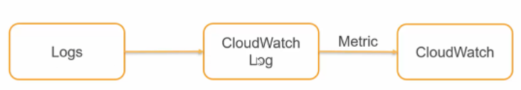

# Monitoring
## [CloudTrail](https://docs.aws.amazon.com/sagemaker/latest/dg/logging-using-cloudtrail.html)
- As AWS cloud is API driven, cloudtrail audits all actions performed on AWS resources										
- Cloudtrail logs can be queried using Athena


- Cloudtrail provides a record of actions taken by a user, role, or an AWS service in SageMaker
- Cloudtrail keeps this record for a period of 90 days
- CloudTrail captures all API calls for SageMaker, with the exception of InvokeEndpoint events										
- [CloudTrail events](https://docs.aws.amazon.com/awscloudtrail/latest/userguide/view-cloudtrail-events.html)
- Based on Information collected by Cloudtrail together with Cloudwatch we can design our "Incident Response"

## Cloudwatch Logs
- Consolidate all the log files generated by the Application and the servers										
- For these consolidated logs, create a metric and then generate alarms using Cloudwatch


## Cloudwatch
- Enables to track Operational metrics of the resources used
- Configure threshold for alarms
- Take automated actions using auto scaling
- We can also publish Custom Metrics to cloudwatch as well


### Cloudwatch Dashboard for Monitoring SGM services
- Build customized dashboards for your CloudWatch metrics (as we have historical data upto 15 months)
- Each dashboard can display multiple metrics and can be accessorized with text and images. 
- You can build multiple dashboards if you’d like, each one focusing on providing a distinct view of your environment. 
- You can even pull data from multiple regions into a single dashboard in order to create a global view."										
- Cloudwatch in turn helps us to visualize the CPU utilization, memory utilization, and latency as the load test runs before deploying in production, and in turn helps to fine-tune the proper Auto Scaling configuration for the model										


### Cloudwatch Events or Alarms										
- CloudWatch Alarms just allows you to watch CloudWatch metrics and to receive notifications when the metrics fall outside of the levels that you configure.										
- For Cases where we need an event-based solution whenever a crawler run completes, we must use CloudWatch Events

## Monitor Overfitting										
- Use Amazon CloudWatch API operations within the training script to deliver training metrics to CloudWatch. 
- Create a CloudWatch alarm that triggers an SNS topic when a model is overfitting and 
- Have each member’s email subscribe to the topic
- You can optionally add a Lambda function to the architecture if you wish to run some mitigation plan (e.g., stop the training when overfitting occurs).


## [How to debug Failure reasons for a Training Job?](https://docs.aws.amazon.com/sagemaker/latest/dg/common-info-all-sagemaker-models-logs.html)
### 1. Getting Failure reason from Training Job										
- If a training job fails, some details about the failure are provided by the FailureReason return value in the training job description										
```
sage = boto3.client('sagemaker')
sage.describe_training_job(TrainingJobName=job_name)['FailureReason']
```
### 2. Getting Failure reason from Cloudwatch logs										
- Misspecifying a hyperparameter or specifying a hyperparameter that is invalid for the algorithm.										
```
[10/16/2017 23:45:17 ERROR 139623806805824 train.py:48]
Additional properties are not allowed (u'mini_batch_siz' was unexpected)
```
- Specifying an invalid value for a hyperparameter.										
```
AlgorithmError: u'abc' is not valid under any of the given schemas 
Failed validating u'oneOf' in schema[u'properties'][u'feature_dim']: 
{
u'oneOf': 
[{u'pattern': u'^([1-9][0-9]*)$', u'type': u'string'}, {u'minimum': 1, u'type': u'integer'}]
}
```										
- Inaccurate protobuf file format										
```
[10/17/2017 18:01:04 ERROR 140234860816192 train.py:48] cannot copy sequence with size 785 to array axis with dimension 784
```									
										
### 3. Other reasons										
- Training Job has wrong Training Image										
- S3 location of data is incorrect										