# Security

## Access Control
- Access to S3 can be controlled  in following ways
1. Resource based policy										
2. User based policy										
3. Combination of Resource based and User based policy										

### 1. Resource based policy is directly attached to the resource for example S3 bucket or object in the bucket
- S3 Bucket Policy
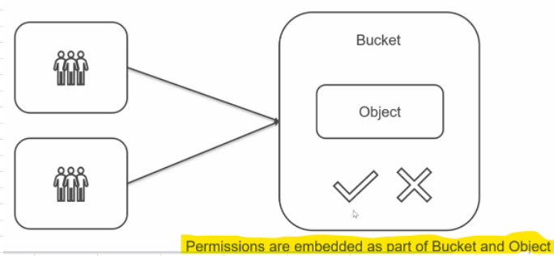

- Use Bucket Policy for making S3 content Available to On Premise Servers
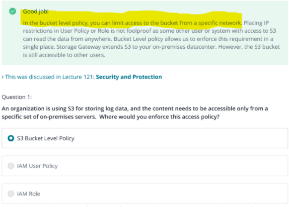

### 2. User based policy is permission granted directly to the user
- IAM Policy
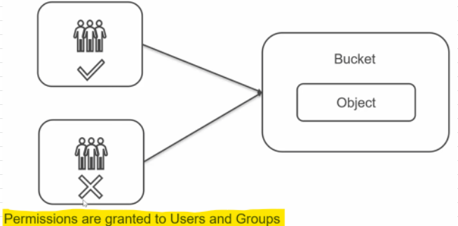

### 3. Combination of  User and Resource based Policy
- Usually combination of User and Resource based policy is used to manage access to S3 
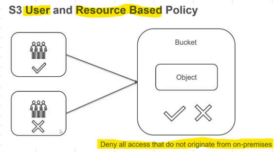

- Deny all access that do not originate from our company network

## Object Tagging
- Object Tagging enables us to tag each object with a Key Value pair
### Scenario: 
- Consider an application that deals with Protected Health information										
- We can Tag the object with a Classification = PHI (Key-Value)										
- Now Define Security Access Ploicy based on the Tag (Classification=PHI)										
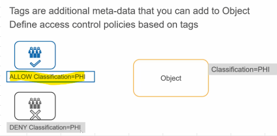

## [Sagemaker and IAM](https://tutorialsdojo.com/aws-identity-and-access-management-iam/)
- SageMaker does not support resource based policies, implies you cannot give permission only for accessing training resources

### [1. Authorization Based on Resource TAGS](https://docs.aws.amazon.com/sagemaker/latest/dg/security_iam_service-with-iam.html)
- IAM Features available with Sagemaker
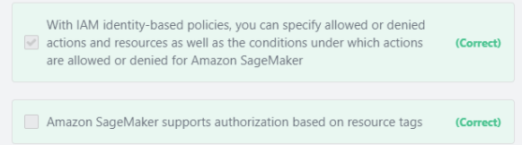

### [2. How to access S3 data in Jupyter NN?](https://docs.aws.amazon.com/sagemaker/latest/dg/gs-config-permissions.html)
- Create a Bucket with word "sagemaker" in its name										
- Create an IAM policy with permission ""S3FullAccess"". 
- Assign this IAM policy to the user via IAM Role

### 3. How to configure User access for each ML team member to work with SageMaker notebook instance
- Create an IAM policy that grants permissions to a user to access his own SageMaker notebook instance. 
- Attach the policy to each member’s IAM user.
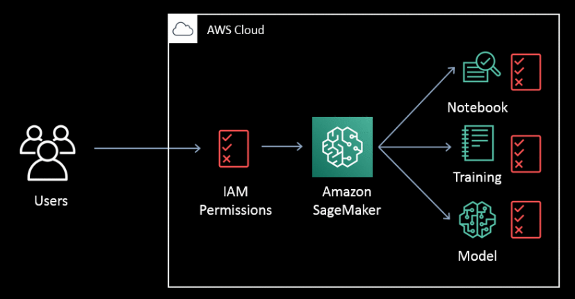

- You can assign an IAM policy permissions set to a user or federated IAM role.

## Encryption
### 1. SSE: Default Key
- Data is stored as Encrypted in physical media and you need a Key (Default key) to access it
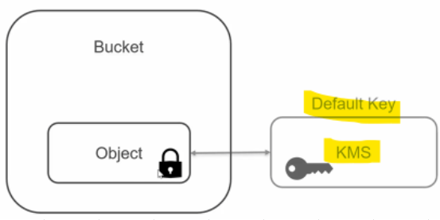

- **KMS (Key Management System manages key**
- When Default key are used, S3 automatically and transparently encrypts and decrypts data when user is allowed access to data in bucket or object
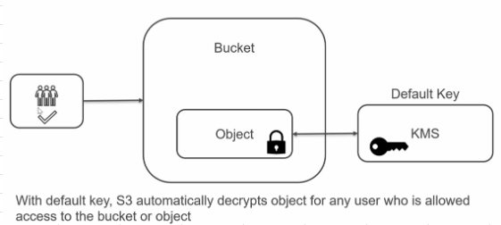

- **In such cases if bucket is made public (Intentailly or accidently), the data can be then accessed by anybody using default keys**

### 2. SSE- Customer Managed Key
- With Customer managed key, even if the bucket is made public, only the user with Customer Managed Key can access the object
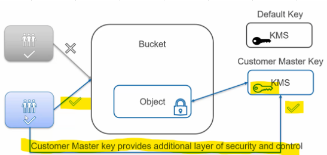

- AWS reccommends to use KMS managed Customer Master Key for securing data

### 3. Client side Encryption
- AWS provides flexibility to Encrypt data in client and store it as it is
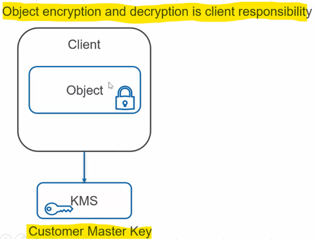

