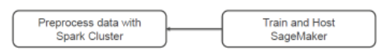
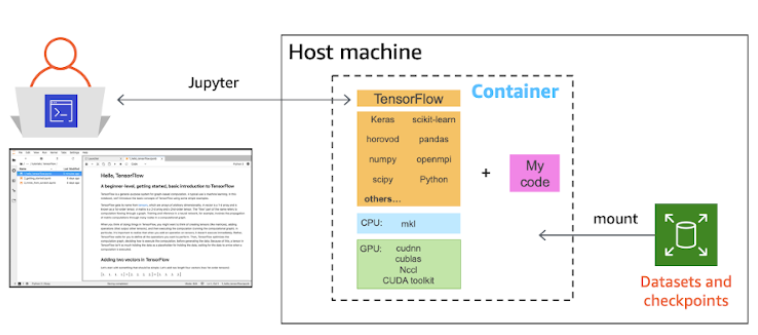

# Training

## 1. Overview of training and deploying a model with Amazon SageMaker

## 2. Benefits of training on AWS cloud
- Distribute training across one or many instances 
- Managed model training infrastructure
- Scales to Petabyte datasets 
- Compute instances for training are automatically launched and released
  - Stores artifacts in S3 
## 3. Tain with Sagemaker
- To train models on SageMaker use										
  - SageMaker Console 
  - SageMaker SDK and 
  - Jupyter Notebook
  - Local Mode training
    - Sagemaker notebook instance is a managed Jupyter Notebook Environment
    - Train a ML model on Sagemaker notebook instance										
    - Make Predictions on the Trained Model on the Sagemaker notebook instance (local mode)													
- **Apache Spark** with Sagemaker 

- SageMaker Apache Spark Library in Python and Scala
- Directly read DataFrames in Spark Clusters
- Sagemaker Estimator automatically converts DataFrames to Protobuf format
- Train and Host using SageMaker 
## 4. Training job
- To train a model in SageMaker, you create a training job. 
- The training job includes the following information:
  - The URL of S3 bucket where you’ve stored the training data.
  - The compute resources (EC2) that you want SageMaker to use for model training. 
    - Compute resources are ML compute instances that are managed by SageMaker.
  - The URL of the S3 bucket where you want to store the output of the job.
  - The Amazon Elastic Container Registry path where the training code (Algorithm) is stored."										

## 5. Algorithms, Frameworks and Container images
| Options | Usage Scenario |
| ------- | -------------- |
| Built-in Algorithms | Training algorithms provided by SageMaker, Easy to use and scale, Optimized for AWS Cloud |
| Pre-built Container Images | Supports popular frameworks like fAxNet. TensorFlow, scikit-learn, PyTorch, Flexibility to use wide selection of algorithms |
| Extend Pre-built Container Images | Extend pre-built container images to your needs  |
| Custom Container Images | Custom algorithm, language and framework Images |
					
### 5.1 [Pre Built Container Images](https://docs.aws.amazon.com/sagemaker/latest/dg/prebuilt-containers-extend.html)
- Train and Host a ML model using SGM supported ML Frameworks Docker Images										
- SGM offers pre built container images for
  - Apache MxNet
  - Tensorflow
  - Scikit learn
  - PyTorch
  - Chainer
  - SparkML
- These Containers can be used as it is to train ML model, saving us time for installing different Libraries for Model training										
- SGM provides SDKs to tain and host models using above frameworks										
- By using pre built containers, we can train and deploy ML models models quickly and reliably at any scale										

#### SGM Local mode Training with Pre built container										
- Amazon SageMaker supports local training using the pre-built TensorFlow and MXNet containers. 
- Amazon SageMaker allows you to pull the containers from SageMaker-specific environments into your working environment.
- This means that if you have a model working locally, it should also work when deployed in a production environment (given that all configurations are correct). 
- This allows you to develop and debug training code efficiently by giving you the convenience of applying fixes to errors and seeing the changes immediately if it works.

### 5.2 Extend Pre Built Container Images										
- The Pre-Built container Images can be modified.
- If a prebuilt SageMaker container doesn't fulfill all of your requirements, you can extend the existing image to accommodate your needs. 
- Even if there is direct support for your environment or framework, you may want to add additional functionality or configure your container environment differently. 
- You can extend the container to add libraries, modify settings, and install additional dependencies.
- By extending a prebuilt image, you can leverage the included deep learning libraries and settings without having to create an image from scratch.

#### Configure Tensorflow Docker Training Container so that it could be run as executable by Amazon SageMaker
Step 1: Add ENTRYPOINT instruction in a Dockerfile										
- `ENTRYPOINT ["python", "custom-algorithm.py"]`
- This will make Docker container to run as an executable										
- `ENTRYPOINT` instruction starts the executable directly, not as a child of `/bin/sh`
- This enables training container to receive signals like SIGTERM and SIGKILL from SageMaker APIs.										
Step 2: Run the container for Model Training										
- `docker run your-docker-image-here train`
- This will run the container for Model training										
- Amazon SageMaker overrides any default CMD statement in a container by specifying the train argument after the image name. 										
- The train argument also overrides arguments that you provide using `CMD` in the Dockerfile.			
#### Configuring SAGEMAKER_PROGRAM										
- Copy the script to the location inside the container that is expected by SageMaker, 
- Provide value for environment variable `SAGEMAKER_PROGRAM` as the `Script Location`
- When training starts, the interpreter executes the entry point defined by `SAGEMAKER_PROGRAM`.
- Replace `customer-algorithm.py` with SAGEMAKER_PROGRAM									
- Further read									
  - https://docs.aws.amazon.com/sagemaker/latest/dg/adapt-training-container.html										
  - https://docs.aws.amazon.com/sagemaker/latest/dg/amazon-sagemaker-toolkits.html										
  - https://github.com/aws/sagemaker-training-toolkit										

#### Set up TensorFlow Docker container and [use Sagemaker SDK to create a model on your local machine](https://aws.amazon.com/blogs/machine-learning/use-the-amazon-sagemaker-local-mode-to-train-on-your-notebook-instance/)
- Pull the TensorFlow Docker container into a local machine and 
- SageMaker Python SDK setup for code testing
  - Execute the `pip install -U sagemaker` command.

### 5.3 Custom Container Images
- Enables us to use our own Algorithms
- Host your custom algorithms on SageMaker
  - Use a runtime and language of your choice
  - Build Containers that conform to SageMaker Specification 
  - **Use your own custom algorithm and put the code together as a Docker image**
- Train and Host on SageMaker 
