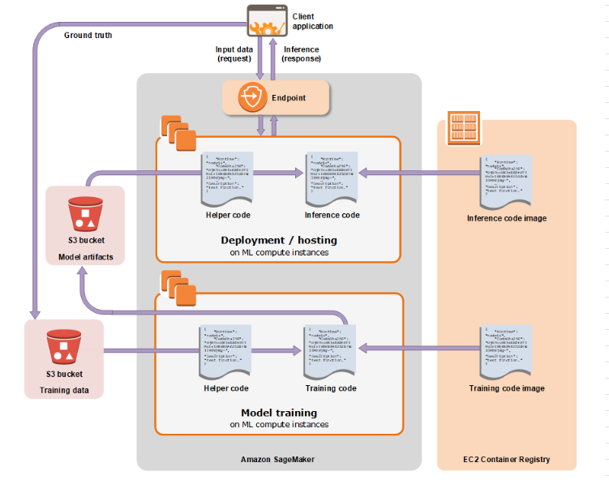

# Training

## Training and Deploying a model with Amazon SageMaker

## Training
- Distribute training across one or many instances 
- Managed model training infrastructure
- Scales to Petabyte datasets 
- Compute instances for training are automatically launched and released
  - Stores artifacts in S3 

## 2. To train models on SageMaker use										
- SageMaker Console 
- SageMaker SDK and 
- Jupyter Notebook

## 3. What information does a Training Job needs?										
- To train a model in SageMaker, you create a training job. 
- The training job includes the following information:
  - The URL of S3 bucket where you’ve stored the training data.
  - The compute resources (EC2) that you want SageMaker to use for model training. 
    - Compute resources are ML compute instances that are managed by SageMaker.
  - The URL of the S3 bucket where you want to store the output of the job.
  - The Amazon Elastic Container Registry path where the training code (Algorithm) is stored."										
## Sagemaker Options for Training and Hosting				
| Options | Usage Scenario |
| ------- | -------------- |
| Built-in Algorithms | Training algorithms provided by SageMaker, Easy to use and scale, Optimized for AWS Cloud |
| Pre-built Container Images | Supports popular frameworks like fAxNet. TensorFlow, scikit-learn, PyTorch Flexibility to use wide selection of algorithms  |
| Extend Pre-built Container Images | Extend pre-built container images to your needs  |
| Custom Container Images | Custom algorithm. language and framework Images |
