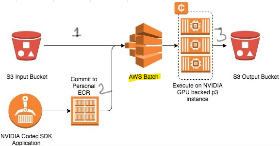
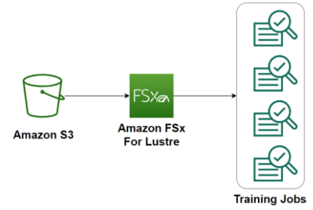
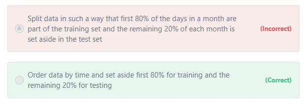
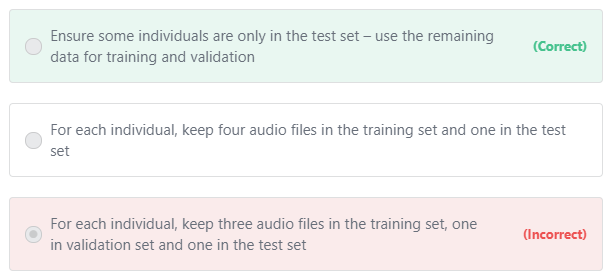

# Training

## Provisioning training infrastructure
### AWS Batch										
- AWS Batch MULTI NODE PARALLEL Jobs enables us to run SINGLE Jobs that span across Multiple EC2 instances										
- It offers Large Scale, Tightly coupled and HPC applications										
- We can also perform GPU based model Training										
- AWS Batch supports Apache MxNet, Tensorflow, Caffe2 and MPI (Message Passing Interface)										
v. Eleminates the need to operate 3rd party commercial or Open source Batch Processing Solutions										
										
1. [AWS Batch for scheduling and configuring Resources](https://aws.amazon.com/batch/use-cases/)
A bioinformatics company wants to automate the secondary analysis of the raw DNA reads into a complete genomic sequence by comparing the multiple overlapping reads and the reference sequence, as well as potentially reduce data errors caused by incorrect alignment between the reference and the sample. 

Which AWS service can be used to configure and schedule this secondary analysis?"										
AWS Batch can be used to configure and schedule resources										
										
2. Replace 3rd party workflows with AWS Batch										
A company is running deep neural networks on GPU-based instances for their product recommendation system. 
The system relies on an ML-workflow that 
- Fetches each dataset from an S3 bucket, 
- Loads it into a Keras model pulled from a local repository, then 
- Continuously delivers the results into a separate bucket. 

The current workflow is expensive to run and involves manual resource management."										
Manage Above Workflow with AWS Batch										

### FSX-Lustre
FSx Lustre and Training										
- Training machine learning models requires providing the training datasets to the training job.										
- When using Amazon S3 as the training data source in File input mode, all training data have to be downloaded from Amazon S3 to the EBS volumes attached to the training instances at the start of the training job										
- A distributed file system such as Amazon FSx for Lustre or EFS can speed up machine learning training by eliminating the need for this download step.										
- If your training data is already in Amazon S3, and your needs do not dictate faster training times for your training jobs, you can get started with Amazon SageMaker with no need for data movement.										
- However, if you need faster startup and training times, we recommend that you take advantage of the Amazon FSx for Lustre file system, which is natively integrated with Amazon S3										

- Amazon FSx for Lustre speeds up your training jobs by serving your Amazon S3 data to Amazon SageMaker at high speeds. 
- The first time you run a training job, Amazon FSx for Lustre automatically copies data from Amazon S3 and makes it available to Amazon SageMaker. 
- Additionally, the same Amazon FSx file system can be used for subsequent iterations of training jobs on Amazon SageMaker, preventing repeated downloads of common Amazon S3 objects. Because of this, Amazon FSx is beneficial for 
- Training jobs that have training sets in Amazon S3 and 
- Traing via in workflows where training jobs must be run several times using different training algorithms or parameters to see which gives the best results
										
- **Pipe Mode** also provides Shorter start up times, as data is being streamed instead of being downloaded to training instances		

### Train-TestSplit								
Timeseries: Train test split										
- A Machine Learning Expert is working on a time series forecasting problem to predict future demand for products.  
- The dataset consists of two years’ worth of historical data. 
- What is the recommended way to split the training and test set?
										
- For time-series forecasting, our objective is to predict the values in the future.  
- To get a realistic assessment of model performance, you need to split the dataset based on time. 
- Set aside the first 70-80% for training and keep the most recent data (toward the end) for testing the accuracy of predictions.

Deep Learning: Train test split										
- You are developing a deep learning network for converting speech to text.  
- The dataset has recordings of 1,000 individuals, with everyone providing five different audio files along with the transcribed text (for a total 5,000 audio samples).  
- The trained model must generalize well for new individuals.  
- How would you use this data for developing a model?
Solution										
- The objective is to ensure the model generalizes well for unheard voices.   
- So, the test set should not contain any individuals from the training or validation set.  
- If we have the same individuals in the training and test set – the model may memorize voice for that individual and may artificially show improved performance.

#### Shuffling Clean and Noisy data to build a model										
- A team of machine learning experts is building a speech recognition system that can work in a noisy factory environment.  
- The dataset consists of 10,000 hours of clean speech data and another dataset with 100 hours of noisy speech data recorded inside the factory.
- How do you define training, validation, and test set? (Select Two)

Approach 1: 
- Train the model on clean data, 
- Split the noisy data into validation and test set. 
- Use the noisy validation data to tune the model performance and perform the final check with test data.										

Approach 2: 
- Split the clean speech data into training and validation sets. 
- Add some of the noisy data to the validation dataset and keep the remaining noisy data for the test set.								
