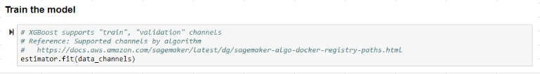
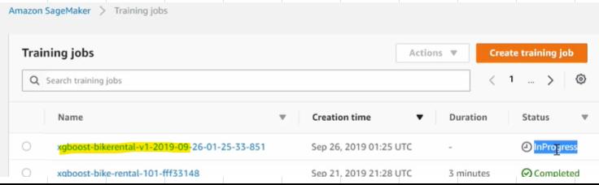

## Provisioning training infrastructure
### AWS Batch										
- AWS Batch MULTI NODE PARALLEL Jobs enables us to run SINGLE Jobs that span across Multiple EC2 instances
- It offers Large Scale, Tightly coupled and HPC applications										
- We can also perform GPU based model Training										
- AWS Batch supports Apache MxNet, Tensorflow, Caffe2 and MPI (Message Passing Interface)
- Eleminates the need to operate 3rd party commercial or Open source Batch Processing Solutions										
#### 1. [AWS Batch for scheduling and configuring Resources](https://aws.amazon.com/batch/use-cases/)
- A bioinformatics company wants to automate the secondary analysis of the raw DNA reads into a complete genomic sequence by comparing the multiple overlapping reads and the reference sequence, as well as potentially reduce data errors caused by incorrect alignment between the reference and the sample. 
- Which AWS service can be used to configure and schedule this secondary analysis?"									- 
AWS Batch can be used to configure and schedule resources										
										
#### 2. Replace 3rd party workflows with AWS Batch										
- A company is running deep neural networks on GPU-based instances for their product recommendation system. 
- The system relies on an ML-workflow that 
  - Fetches each dataset from an S3 bucket, 
  - Loads it into a Keras model pulled from a local repository, then 
  - Continuously delivers the results into a separate bucket. 
- The current workflow is expensive to run and involves manual resource management.
- Manage Above Workflow with AWS Batch										


### FSx Lustre and Training									
- Training machine learning models requires providing the training datasets to the training job.							
- When using Amazon S3 as the training data source in File input mode, all training data have to be downloaded from Amazon S3 to the EBS volumes attached to the training instances at the start of the training job										
- A distributed file system such as Amazon FSx for Lustre or EFS can speed up machine learning training by eliminating the need for this download step.	
- If your training data is already in Amazon S3, and your needs do not dictate faster training times for your training jobs, you can get started with Amazon SageMaker with no need for data movement.										
- However, if you need faster startup and training times, we recommend that you take advantage of the Amazon FSx for Lustre file system, which is natively integrated with Amazon S3										


- Amazon FSx for Lustre speeds up your training jobs by serving your Amazon S3 data to Amazon SageMaker at high speeds. 
- The first time you run a training job, Amazon FSx for Lustre automatically copies data from Amazon S3 and makes it available to Amazon SageMaker. 
- Additionally, the same Amazon FSx file system can be used for subsequent iterations of training jobs on Amazon SageMaker, preventing repeated downloads of common Amazon S3 objects. Because of this, Amazon FSx is beneficial for 
- Training jobs that have training sets in Amazon S3 and 
- Traing via in workflows where training jobs must be run several times using different training algorithms or parameters to see which gives the best results
										
- **Pipe Mode** also provides Shorter start up times, as data is being streamed instead of being downloaded to training instances		

### Train-TestSplit								
#### Timeseries: Train test split										
- A Machine Learning Expert is working on a time series forecasting problem to predict future demand for products.  
- The dataset consists of two years’ worth of historical data. 
- What is the recommended way to split the training and test set?
										
- For time-series forecasting, our objective is to predict the values in the future.  
- To get a realistic assessment of model performance, you need to split the dataset based on time. 
- Set aside the first 70-80% for training and keep the most recent data (toward the end) for testing the accuracy of predictions.


#### Deep Learning: Train test split										
- You are developing a deep learning network for converting speech to text.  
- The dataset has recordings of 1,000 individuals, with everyone providing five different audio files along with the transcribed text (for a total 5,000 audio samples).  
- The trained model must generalize well for new individuals.  
- How would you use this data for developing a model?
Solution										
- The objective is to ensure the model generalizes well for unheard voices.   
- So, the test set should not contain any individuals from the training or validation set.  
- If we have the same individuals in the training and test set – the model may memorize voice for that individual and may artificially show improved performance.


#### Shuffling Clean and Noisy data to build a model										
- A team of machine learning experts is building a speech recognition system that can work in a noisy factory environment.  
- The dataset consists of 10,000 hours of clean speech data and another dataset with 100 hours of noisy speech data recorded inside the factory.
- How do you define training, validation, and test set? (Select Two)

##### Approach 1: 
- Train the model on clean data, 
- Split the noisy data into validation and test set. 
- Use the noisy validation data to tune the model performance and perform the final check with test data.			

##### Approach 2: 
- Split the clean speech data into training and validation sets. 
- Add some of the noisy data to the validation dataset and keep the remaining noisy data for the test set.

## Folder structure
- A Machine Learning Specialist wishes to train a model on an Amazon SageMaker notebook instance. 
- The Specialist will build a custom training container using a python training script that he developed on his local machine.
- Where should the Specialist save the training script?


- The SageMaker containers library places the scripts that the container will run in the /opt/ml/code/ directory. 
- Your script should write the model generated by your algorithm to the /opt/ml/model/ directory

### [Saving our NB files from overwriting](https://docs.aws.amazon.com/sagemaker/latest/dg/howitworks-create-ws.html)
- /home/ec2-user/SageMaker										
- You have launched a new Jupyter Notebook instance and you want to make sure that you don’t lose any files and data when the notebook instance restarts. 
- Where should you save your files and data so that they are not overwritten on restart?

- Only files and data saved within the /home/ec2-user/SageMaker folder persist between notebook instance sessions. 
- Files and data that are saved outside this directory are overwritten when the notebook instance stops and restarts

## [Content Type parameter](https://docs.aws.amazon.com/sagemaker/latest/dg/cdf-training.html)


- Content Type parameter for unsupervised learning algorithm with Training data as CSV									
- To run unsupervised learning algorithms as they don't have a target, specify the number of label columns ""label_size"" as ""0"" in the content type
 'text/csv;label_size=0'
					
### RecordIO	
- RecordIO is the name for a set of binary data exchange formats. 
- The basic idea is to divide the data into individual chunks, called 'records', and then to prepend to every record its length in bytes, followed by the data.
- RecordIO and RecordIO-protobuf are different formats										
- Algorithm specific formats										
  - JSON									
  - LibSVM formats
  - Parquet
  - JPEG
  - PNG
  - x-image
## Train-Test Channels
### Options to upload Training data to S3										
1. Upload entire Dataset in a single file										
2. Split dataset across several files in a folder										
										
### How to copy data from S3 to Training Instance										
1. File Mode										
- Copies entire dataset to Training Compute Instance Disk										
- Training job copies data from S3 to Training Instance
- Space needed = Entire data set + Final model artifacts
2. Pipe Mode										
- Streams data from S3 to Training Compute Instance Disk										
- Training job streams data from S3 to Training Instance
- Faster start time and Better throughput
- Space needed = Final model artifacts
### During Model Training, we indicate Train and Test dataset by using Training and Test Channels
- Refer ["data_format_exploration.ipynb"](https://github.com/ChandraLingam/AmazonSageMakerCourse/blob/master/xgboost/DataFormats/data_format_exploration.ipynb) for 										
  - How to write CSV file to SageMaker instance?										
  - How to write to S3?										
  - How to download from S3?										
  - How to create RecordIO format?										
### [Pipe Mode](https://tutorialsdojo.com/amazon-sagemaker/)
- In Pipe mode training job stream data directly form S3 (it is not copying data to training instance)
- SGM algorithms works best when we use "protobuf recordIO" data format for training
- When using  "protobuf recordIO" data format for training, we can take advantages of "Pipe mode"


#### Advantages of Pipe mode										
- Shorter start up times, as data is being streamed instead of being downloaded to training instances
- Higher I/O Throughput due to High performing streaming agent										
- Virtually limitless data processing capacity										


## [Lifecycle configuration](https://docs.aws.amazon.com/sagemaker/latest/dg/notebook-lifecycle-config.html)
- A Machine Learning Specialist is working on a project using a Conda environment hosted on a SageMaker notebook instance. To save on cost, the Specialist manually stops the instance when he’s no longer using it. However, whenever the instance is restarted, the Specialist finds himself reinstalling the necessary external libraries for his project.
- Which method must be done to automate the installation of libraries										
### Solution
- Amazon SageMaker provides you the ability to manually install additional libraries on your notebook instances. 
- However, once your notebook instance is terminated, these additional customizations are removed as well, requiring that you manually add them again when you restart your notebook instances.
- With the Lifecycle configuration feature in Amazon SageMaker, you can automate these customizations to be applied at different phases of the lifecycle of an instance. 
- For example, you can write a script to install a list of libraries and, using the Lifecycle configuration feature, configure the scripts to automatically execute every time your notebook instance is started. 
- Similarly, you can choose to automatically run the script only once when the notebook instance is created.
- Hence, Use a lifecycle configuration script to bootstrap the package installation.
- [more](https://aws.amazon.com/blogs/machine-learning/customize-your-amazon-sagemaker-notebook-instances-with-lifecycle-configurations-and-the-option-to-disable-internet-access/)


## Train/Fit the Model
1. Train


2. What happens during Fit process?
- Training Instance is launched										
- Algorithm Container Image is downloaded from ECR										
- Container Image is deployed to the Training Instance										


- Model fits and calculates RMSE for each Tree


3. Verify Training Job on console


## [Security with Network Isolation](https://docs.aws.amazon.com/sagemaker/latest/dg/mkt-algo-model-internet-free.html)
- SageMaker training and deployed inference containers are internet-enabled by default.
- This allows containers to access external services and resources on the public internet as part of your training and inference workloads
- If you enable network isolation, the containers can't make any outbound network calls, even to other AWS services such as Amazon S3.
- SageMaker still performs download and upload operations against Amazon S3 using your SageMaker execution role in isolation from the training or inference container
- Network isolation is not supported by the following managed Amazon SageMaker containers as they require access to Amazon S3
  - Chainer
  - PyTorch
  - Scikit-learn
  - Amazon SageMaker Reinforcement Learning


### Inter-Container traffic encryption										
- When performing distributed training, you can further protect data that is transmitted between instances. 
- Use Inter-Container Traffic Encryption to comply with regulatory requirements.
- Enabling inter-container traffic encryption can increase training time, especially if you are using distributed deep learning algorithms.
										
- Enabling inter-container traffic encryption doesn't affect training jobs with a single compute instance.
- However, for training jobs with several compute instances, the effect on training time depends on the amount of communication between compute instances. 
- For affected algorithms, adding this additional level of security also increases cost. 
- The training time for most SageMaker built-in algorithms, such as XGBoost, DeepAR, and linear learner, typically aren't affected.

## [Algorithm Registry Path and Version Tag](https://docs.aws.amazon.com/sagemaker/latest/dg/sagemaker-algo-docker-registry-paths.html)
- For the Training Image and Inference Image Registry Path column, use the :1 version tag to ensure that you are using a stable version of the algorithm. 
- You can reliably host a model trained using an image with the :1 tag on an inference image that has the :1 tag. 
- Using the **:latest** tag in the registry path provides you with the most up-to-date version of the algorithm, but might cause problems with backward compatibility. 
- Avoid using the :latest tag for production purposes
- [Get Image Registry path example](https://docs.google.com/spreadsheets/d/1JoDU8_DzRTr0l6vADyqkqLlFqgSh9ciw/edit#gid=1732384361)
- Version Tag in Registry Path for Production systems ":1"										


## Trained Model Deserialization										
- Amazon Sagemaker models are stored in **model.tar.gz** format
- When model.tar.gz is untarred, it contains model_algo-1, which is a serialized Apache MXNet object
### Example										
- Use the following to load the k-means model into memory and view it:										
```
"import mxnet as mx
print(mx.ndarray.load('model_algo-1'))
```
## Distributed Training
### 1. Data parallelism										
- In this strategy of distributed training:
  - Training dataset is split up across multiple processing nodes (such as AWS ML Instances), and 
  - Each processing node contains a replica of the model.
- Each node 
  - Receives different batches of training data, 
  - Performs a forward and backward pass, and 
  - Shares weight updates with the other nodes for synchronization before moving on to the next batch and ultimately another epoch
### 2. Model parallelism										
- In this strategy of distributed training, the Model is partitioned across multiple processing nodes (such as AWS ML Instances)
- The model might be complex and have a large number of hidden layers and weights, making it unable to fit in the memory of a single node. 
- Each node carries a subset of the model, through which the data flows and the transformations are shared and compiled.
- The efficiency of model parallelism, in terms of GPU utilization and training time, is heavily dependent on 
  - How the Model is partitioned and 
  - The Execution Schedule used to perform forward and backward passes
### 3. Pipeline Execution Schedule (Pipelining										
- During model training, the Pipeline Execution Schedule determines the order in which
  - Computations (micro-batches) are made and 
  - Data is processed across devices
- Pipelining is a technique 
  - To achieve true parallelization in model parallelism and 
  - Overcome the performance loss due to sequential computation by having the GPUs compute simultaneously on different data samples.
										
### Which Is “Better”: Data Parallel or Model Parallel?										
- If your Model can fit into memory, you can use Data parallel training, and you should, as training is faster. 
- However, this isn’t always possible, and so for Large models, you must use Model parallel training"																	
### [Data Parallelism- S3DataDistributionType](https://docs.aws.amazon.com/sagemaker/latest/APIReference/API_S3DataSource.html)
- If you want Amazon SageMaker to replicate the entire dataset on each ML compute instance that is launched for model training, specify 
**S3DataDistributionType** as **FullyReplicated**
- If you want Amazon SageMaker to replicate a subset of data on each ML compute instance that is launched for model training, specify 
**S3DataDistributionType** as **ShardedByS3Key**

## Managed Spot Training										
- Managed Spot Training uses Amazon EC2 Spot instance to run training jobs instead of on-demand instances.
- Metrics and logs generated during training runs are available in CloudWatch.										
- Amazon SageMaker Automatic Model Tuning, also known as hyperparameter tuning, can use managed spot training																
### Stopping Condition										
- During Model Training, you can specify :
  - Which Training jobs use spot instances and 
  - a Stopping Condition that specifies how long SageMaker waits for a job to run using Amazon EC2 Spot instances. 
- *If Stopping consition is not satisfied, then training job will continue with On Demand/Reserved Instances
										
### Checkpoints										
- Spot instances can be interrupted, causing jobs to take longer to start or finish. 
- You can configure your managed spot training job to use checkpoints.								
- SageMaker copies checkpoint data from a local path to Amazon S3. 
- When the job is restarted, SageMaker copies the data from Amazon S3 back into the local path. 
- The training job can then resume from the last checkpoint instead of restarting
## Validating Models
### 1. Offline testing										
- Use historical (not live) data to send requests to the model for inferences										
- Options for offline model evaluation include:										
  - Validating using a holdout set
  - k-fold validation
										
### 2. Online testing with live data										
- SageMaker supports A/B testing for models in production by using production variants. 
- Production variants are models that use the same inference code and are deployed on the same SageMaker endpoint
- You configure the production variants so that a small portion of the live traffic goes to the model that you want to validate.
- For example, you might choose to send 10% of the traffic to a model variant for evaluation. After you are satisfied with the model's performance, you can route 100% traffic to the updated model			

## Training questions
1. Once training dataset is ready, what would be the next steps?										
- Shuffle the dataset
- Do splits for training set, validation set and test set.										
										
2. How would you use GPUs for both training and inference?										
- Select the Sagemaker built-in Algorithm that supports GPUs for both training and inference
- Choose the correct instance type that supprts GPU										
										
3. [Which method can be used to get the training job status?](https://docs.aws.amazon.com/sagemaker/latest/dg/ex1-train-model.html)
- describe_training_job										
										
4. [Image Rotation problem](https://stats.stackexchange.com/questions/239076/about-cnn-kernels-and-scale-rotation-invariance)
- You are working on a computer vision application (using Convolutional Neural Networks) to recognize an endangered species of tigers. 
- 70% of the incorrectly classified images from the CNN were in a 90-degrees counter-clockwise rotated state. 

5. What corrective action you will take to address this issue?										
- CNN needs to be retrained with more images that are in a 90-degrees counter-clockwise rotated state										
- Adding more hidden layers or hyperparameter tuning will not help, they are just meant to throw you off										
										
5. [Training with CSV files](https://docs.aws.amazon.com/sagemaker/latest/dg/cdf-training.html)
- For those SageMaker supervised learning algorithms which require the training data to be in CSV format, 
  - the target variable should be in the first column and 
  - it should not have a header record										
										
6. [Algorithms with Tensorflow support]
- {XGBoost on Tensorflow](https://docs.aws.amazon.com/sagemaker/latest/dg/xgboost.html)
  - The XGBoost algorithm can be used as a built-in algorithm or as a framework such as TensorFlow.										
- [Neo Supports Image Classification](https://docs.aws.amazon.com/sagemaker/latest/dg/neo.html)
  - Neo currently supports image classification models exported as frozen graphs from TensorFlow, MXNet, or PyTorch, and XGBoost models										
										
7. [SageMaker algorithms that support incremental training](https://docs.aws.amazon.com/sagemaker/latest/dg/incremental-training.html)
- Object Detection Algorithm, 
- Image Classification Algorithm, and 
- Semantic Segmentation Algorithm										
										
8. Network isolation is not supported by the following managed Amazon SageMaker containers as they require access to Amazon S3										
- Chainer
- PyTorch
- Scikit-learn
- Amazon SageMaker Reinforcement Learning										
										
9. Frameworks supporting EI (~Frameworks that supports Image Classification)										
- MxNet 
- Tensorflow 
- PyTorch										
