# GCP Infrastructure
- [Compute](#compute)
  - [Pre trained AI blocks](#pre-trained-ai-blocks)
  - [TPUs](#tpus)
- [Storage](#storage)
  - [Resource hierarchy](#resource-hierarchy)
  - [Copying data to cloud](#copying-data-to-cloud)
- [Networking](#networking)
  - [POPs and Network](#pops-and-network)
  - [Shared responsibilty](#shared-responsibilty)
- [Security](#security)
  - [Communications to Google Cloud](#communications-to-google-cloud)
  - [Stored data](#stored-data)
  - [Big Query as a security example](#big-query-as-a-security-example)
# [Big data and ML products](#big-data-and-ml-products)
  - [Innovation Timeline](#innovation-timeline)
  - [Innovations available via Cloud](#innovations-available-via-cloud)
  - [Compute services](#compute-services)
  - [Storage services](#storage-services)
  - [Bigdata Services](#bigdata-services)
  - [AI Services](#ai-services)
  - [Bigdata suite](#bigdata-suite)

## Compute
### Pre trained AI blocks
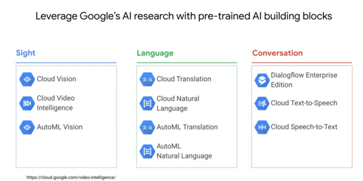

### TPUs 
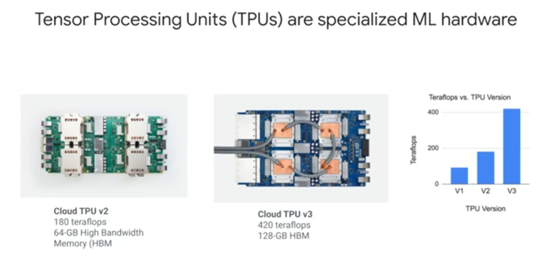

## Storage

### Resource hierarchy
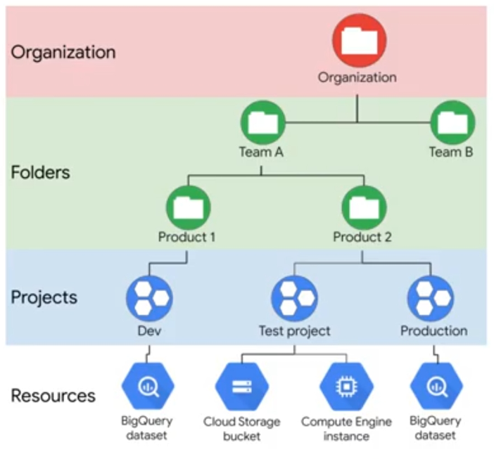

### Copying data to cloud
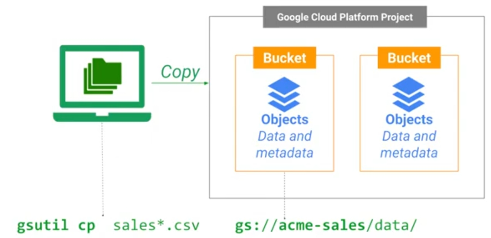

## Networking
### POPs and Network
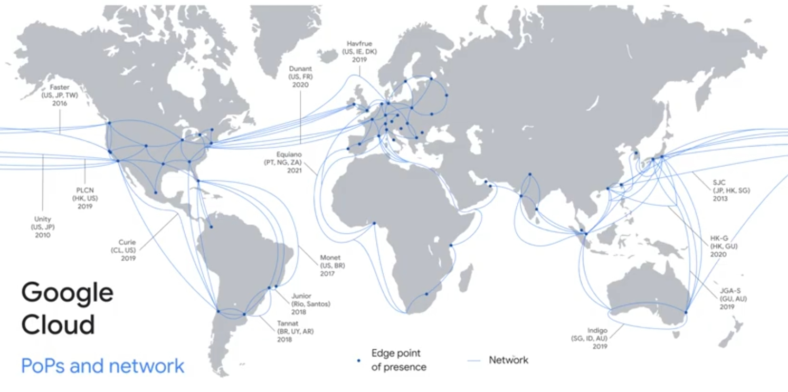

### Shared responsibilty
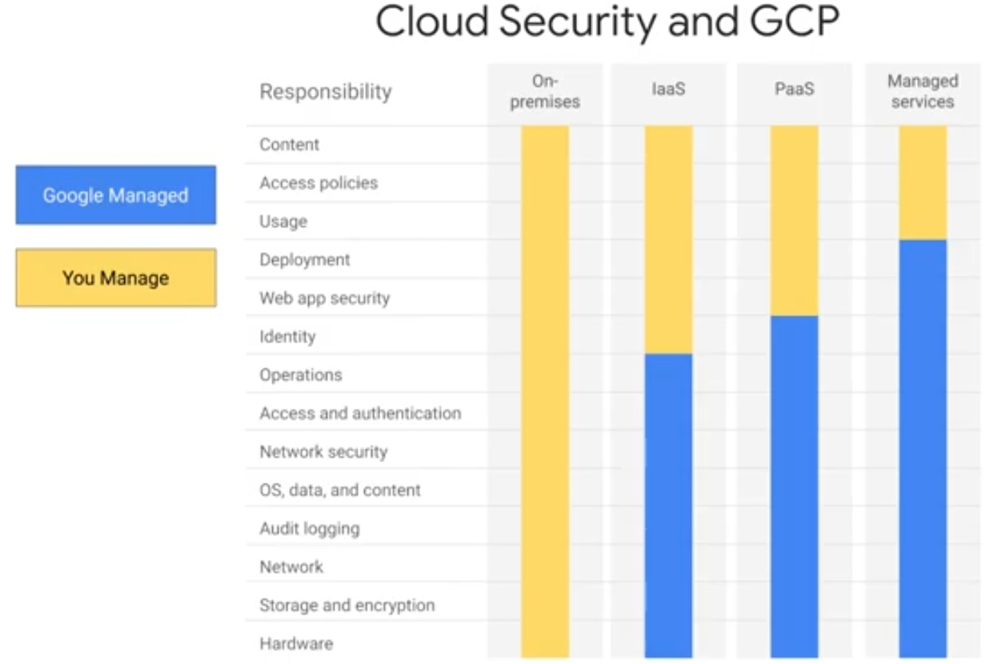

## Security
### Communications to Google Cloud
- Communications to Google Cloud are `encrypted in transit` 
  - In-transit encryption
- Multiple layers of security
- Backed by Google security teams 24/7 
### Stored data
- Stored data is `encrypted at rest` and `distributed`
  - Data automatically encrypted at rest 
  - Distributed for availability and reliability 

### Big Query as a security example
- Offers Granular control over `data access`
- BigQuery table data encrypted with keys (and those keys are also encrypted) 
- Monitor and flag queries for anomalous behavior 
- Limit data access with authorized views 

## Big data and ML products
### Innovation Timeline
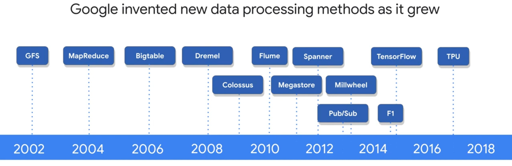

### Innovations available via Cloud
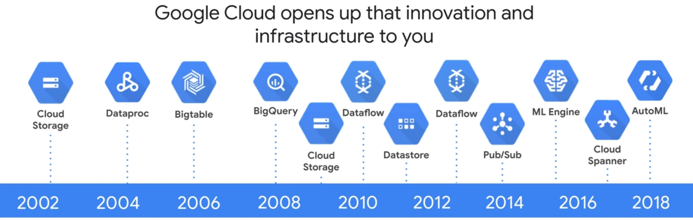

### Compute services
- Compute engine
- Google kubernetes engine (GKE)
- App engine
- Cloud functions

### Storage services
- Cloud bigtable
- Cloud storage
- Cloud SQL
- Cloud spanner
- Cloud datastore

### Bigdata Services
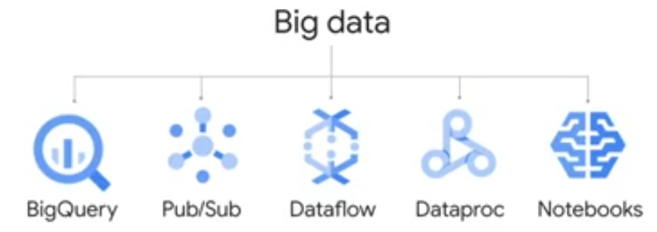

### AI Services
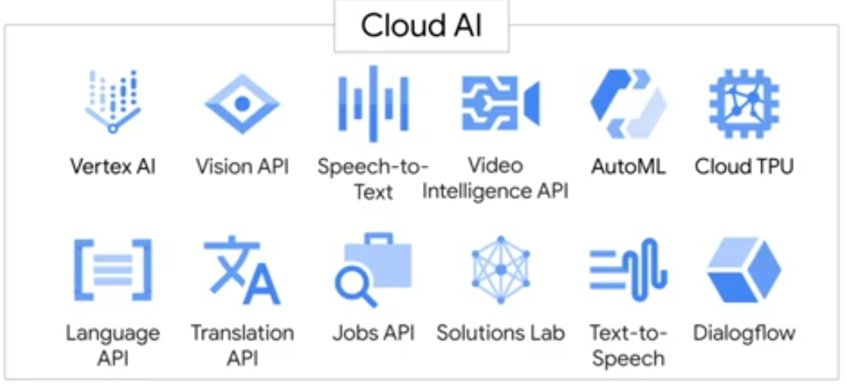

### Bigdata suite
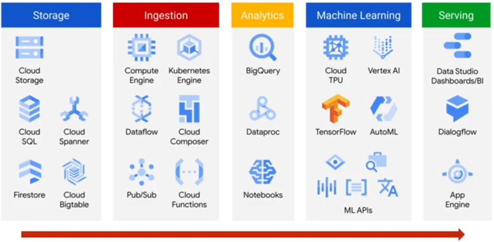
